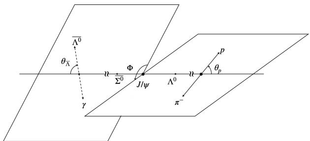
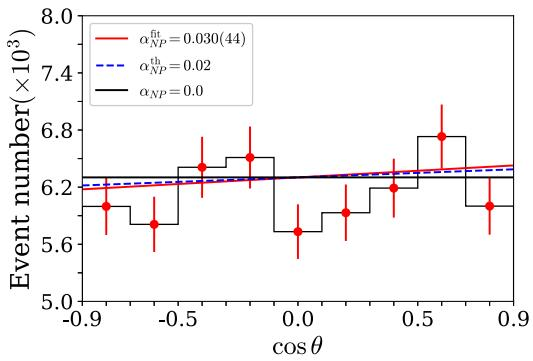
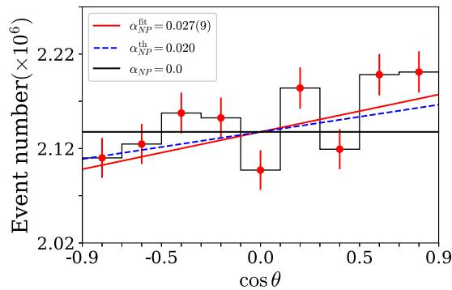
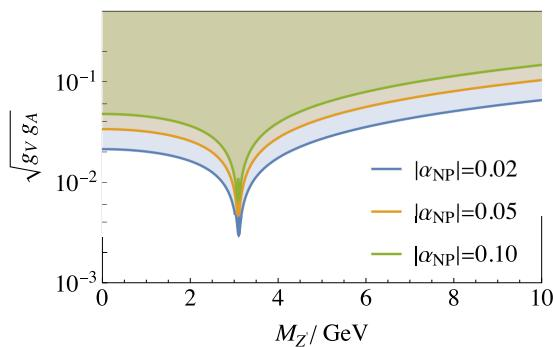
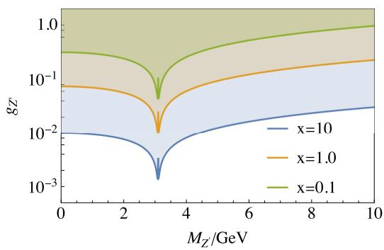

PAPER • OPEN ACCESS

# New signature of low mass  $Z$  in  $J / \psi$  decays

To cite this article: Chao-Qiang Geng et al 2024 Chinese Phys. C 48 081001

View the article online for updates and enhancements.

# You may also like

- Astrophysical S-factor and reaction rate for  ${}^{15}\mathrm{N}(p)$  within the modified potential cluster model

S. B. Dubovichenko, A. S. Tkachenko, R. Ya. Kezerashvili et al.

- Dark energy and matter interacting scenario to relieve  $H_{\mathrm{e}}$  and  $S_{\mathrm{e}}$  tensions Li-Yang Gao, , She-Sheng Xue et al.

# New signature of low mass  $Z'$  in  $J / \psi$  decays*

Chao-Qiang Geng (耿朝强)1 Chia-Wei Liu (劉佳韋)2 Jiabao Zhang (張嘉宝)1,3†

$^{1}$ School of Fundamental Physics and Mathematical Sciences, Hangzhou Institute for Advanced Study, UCAS, Hangzhou 310024, China

$^{2}$ Tsung-Dao Lee Institute & School of Physics and Astronomy, Shanghai Jiao Tong University, Shanghai 200240, China

$^{3}$ Institute of Theoretical Physics, University of Chinese Academy of Sciences, Beijing 100190, China

Abstract: We explored a new approach to search for a low-mass  $Z'$  particle through  $J / \psi$  decays by identifying its existence through parity-violating phenomena in the isospin-violating final states of  $\Lambda \overline{\Sigma}^0$  and the corresponding charge conjugated states of  $\overline{\Lambda}\Sigma^0$ . Our investigation centered on a generation-independent and leptophobic  $Z'$  with mass below 10 GeV. Given the present experimental conditions at Beijing Spectrometer III (BESIII) and the anticipated opportunities at the Super Tau Charm Factory (STCF), we conducted Monte-Carlo simulations to predict possible events at both facilities. Notably, we foresee a substantial enhancement in the precision of the lower limit estimation of  $\alpha_{\mathrm{NP}}$  as well as a reduction in statistical uncertainty with upcoming STCF experiments. Furthermore, it is essential to highlight that a null result in the measurement of  $\alpha_{\mathrm{NP}}$  would impose stringent constraints, requiring the  $Z' - q - q$  couplings to be in the order of  $10^{-2}$ .

Keywords:  $Z^{\prime}$ , parity violation,  $J / \psi$

DOI: 10.1088/1674-1137/ad53b6

As an extra neutral  $U(1)$  gauge boson,  $Z^{\prime}$  manifests itself in many extensions of the standard model (SM), such as the Grand Unified Theories (GUTs) [1-8], heterotic string theory [9], left-right symmetric models [10-14], and gauged B-L models [15-17]. Searching for such a gauge boson helps us to gain more insight about the fundamental theory beyond the SM. Experimentally, direct searches for the  $Z^{\prime}$  boson are conducted in various types of high energy colliders, including  $e^{+}e^{-}$  colliders such as LEP, and hadron colliders such as Tevatron and LHC. Various mass ranges of  $Z^{\prime}$  are scanned, and the couplings of  $Z^{\prime}$  with both leptons and quarks are constrained. In the case of leptonic collider searches, the agreement between LEP-II measurements and SM predictions regarding the cross-section of  $e^{+}e^{-}\rightarrow f\bar{f}$  implies that either  $M_{Z^{\prime}} > 209$  GeV or that the  $Z^{\prime}$  couplings with leptons are smaller than  $10^{-2}$  [18-20]. Stronger constraints have also been found through dark photon searches in various experiments [21-24]. The limit on the couplings between  $Z^{\prime}$  and leptons is approximately  $10^{-4}$ . Besides, some indirect searches through neutrino-electron scatterings are also proposed and severe constraints are established on various neutrino experiments [25, 26].

These searches have led to the study of the lepto-

phobic  $Z^{\prime}$  boson, which interacts exclusively with quarks and is extensively searched on hadronic colliders. Through extensive scanning of the dijet mass spectrum, upper limits on the  $Z^{\prime}$  couplings have been established by the CMS collaboration in the mass range from several TeV down to 10 GeV [27-31]. For  $Z^{\prime}$  bosons with masses below 10 GeV, comprehensive explorations on the hadron colliders are limited owing to significant background interferences. While some progress has been made through nonstandard quarkonium decays [32-35], there remains a pressing need for additional strategies to comprehensively investigate this specific low mass range.

To address this critical research gap, we propose to conduct the search for the  $Z^{\prime}$  boson on lepton colliders, such as Beijing Spectrometer III (BESIII) and the forthcoming Super Tau Charm Factory (STCF), which have a very clean background as well as a large volume of data samples. The BESIII collaboration achieved a significant milestone, accumulating a staggering amount of  $10^{10}J / \psi$  events by 2019, with many of these events producing polarized baryon-antibaryon pairs [36]. Leveraging the entanglement of final states has enabled the extraction of observables at an unprecedented level of accuracy, offering an excellent platform for probing new physics (NP)

phenomena [37, 38]. Moreover, the future STCF is designed to take  $1ab^{-1}$  data, corresponding to  $3.4 \times 10^{12} J/\psi$  events per year [39], promising even higher precision in relevant processes. One of the  $Z'$  models has been proposed to relieve the tensions in the  $J/\psi \rightarrow \pi^{+}\pi^{-}$  and  $\psi(2S) \rightarrow \pi^{+}\pi^{-}$  branching fractions with fitted pion form factors [40]. In this study, we focused on parity violation in  $J/\psi \rightarrow \Lambda \overline{\Sigma}^{0}$  and its charge conjugate. Dominated by a single virtual photon exchange, the nonperturbative effects stemming from gluon exchanges in such decays are comparatively suppressed, allowing for a factorizable amplitude at the first order in theoretical calculations [41, 42]. Furthermore, the SM prediction for parity violation in  $J/\psi \rightarrow \Lambda \overline{\Sigma}^{0} + c.c.$  vanishes, leading to a clean background for the detection of  $Z'$ . The BESIII collaboration has recently analyzed  $CP$  violation in  $J/\psi \rightarrow \Lambda \overline{\Sigma}^{0}$  [43]. They have measured the ratio between electric and magnetic form factors with high precision, demonstrating their capability to accurately reconstruct decay distributions. However, their study assumed spatial inverse parity symmetry, a constraint we have relaxed in our research, representing the main contribution of our study.

The parity violating effect is characterized by the polarization asymmetry parameter  $\alpha_{\mathrm{NP}}$  for the decay of  $J / \psi \rightarrow \Lambda \overline{\Sigma}^0$ . Experimentally,  $\alpha_{\mathrm{NP}}$  is available from the angular distribution as follows:

$$
\frac {1}{\Gamma} \frac {\partial \Gamma}{\partial \cos \theta_ {p}} = 1 + \alpha_ {\mathrm {N P}} \alpha_ {\Lambda} \cos \theta_ {p} = 1 + \alpha \cos \theta_ {p}, \tag {1}
$$

where  $\alpha_{\Lambda} = 0.748(7)$  is the asymmetry parameter in  $\Lambda \rightarrow p\pi^{-}$  [31] and  $\theta_p$  is the angle between  $\vec{p}_{\Lambda}$  and  $\vec{p}_p$  defined at the rest frames of  $\Lambda$ . Theoretically,  $\alpha_{\mathrm{NP}}$  is defined as

$$
\alpha_ {\mathrm {N P}} = \frac {\left| h _ {+ +} \right| ^ {2} + \left| h _ {+ -} \right| ^ {2} - \left| h _ {- +} \right| ^ {2} - \left| h _ {- -} \right| ^ {2}}{\left| h _ {+ +} \right| ^ {2} + \left| h _ {+ -} \right| ^ {2} + \left| h _ {- +} \right| ^ {2} + \left| h _ {- -} \right| ^ {2}}, \tag {2}
$$

where  $h_{\lambda \overline{\lambda}}$  are the helicity amplitudes of  $J / \psi \rightarrow \Lambda \overline{\Sigma}^0$ , with  $\lambda$  and  $\overline{\lambda}$  representing the helicities of  $\Lambda$  and  $\overline{\Sigma}^0$ , respectively. When parity symmetry holds, we have  $|h_{\lambda \overline{\lambda}}|^2 = |h_{-\lambda -\overline{\lambda}}|^2$  and consequently  $\alpha_{\mathrm{NP}} = 0$ . Therefore, a nonzero value of  $\alpha_{\mathrm{NP}}$  indicates the violation of parity symmetry.

Additionally, the angular distribution for the charge-conjugate process, namely,  $J / \psi \rightarrow \Sigma^0\overline{\Lambda} (\rightarrow \overline{p}\pi^+)$ , is given by simply substituting  $(\overline{\alpha}_{\mathrm{NP}},\overline{\alpha}_{\Lambda},\overline{\alpha})$  for  $(\alpha_{\mathrm{NP}},\alpha_{\Lambda},\alpha)$  in Eq. (1). It is important to note that  $\overline{\alpha}_{\Lambda}$  denotes the asymmetry parameter for  $\overline{\Lambda}\rightarrow \overline{p}\pi^{+}$ , with a measured value of  $-0.757(4)$  according to the Particle Data Group (PDG) [31]. Under the assumption that  $CP$  symmetry is conserved in the decay of  $\Lambda \rightarrow p\pi^{-}$ , we constructed the  $CP$ -even and  $CP$ -odd observables as  $\alpha_{\pm} = (\alpha \pm \overline{\alpha}) / 2$ . It is worth highlighting that within the SM, both  $\alpha_{+}$  and  $\alpha_{-}$  remain below the threshold of  $10^{-3}$ . Furthermore, by considering two fold cascade decays, such as those depicted

  
Fig. 1. Decay distributions of  $J / \psi \to \Lambda (\to p\pi^{-})\overline{\Sigma}^{0}(\to \overline{\Lambda}\gamma)$

in Fig. 1, more observables can be extracted.

We adopt the general effective Lagrangian describing the  $Z^{\prime}$  boson, as prescribed by the PDG [31]. In the context of the  $J / \psi \rightarrow \Lambda \overline{\Sigma}^{0}$  decay process, our analysis focused exclusively on the isovector-axial vector current, denoted as  $(\bar{u}\gamma_{\mu}\gamma_{5}u - \bar{d}\gamma_{\mu}\gamma_{5}d)$ , and the vector current of  $\bar{c}\gamma_{\mu}c$ . Consequently, the effective Lagrangian tailored for our investigation is as follows:

$$
Z _ {\mu} ^ {\prime} \left[ g _ {A} \left(\bar {u} \gamma^ {\mu} \gamma_ {5} u - \bar {d} \gamma^ {\mu} \gamma_ {5} d\right) + g _ {V} \bar {c} \gamma^ {\mu} c \right] + C, \tag {3}
$$

where  $g_{A} = (g_{u}^{R} - g_{d}^{R}) / 4$  and  $g_{V} = (g_{u}^{R} + g^{L}) / 2$  represent the pertinent coupling constants. The vector current  $\bar{c}\gamma_{\mu}c$  is dictated by the annihilation of  $J / \psi$ , and the axial vector currents of  $u,d$  quarks are considered to introduce parity violation. Owing to the requirement of Hermiticity,  $g_{A}$  and  $g_{V}$  must be real, thereby ensuring  $CP$  conservation and  $\alpha_{-} = 0$ . Other terms in the Lagrangian are collectively designated as Cand do not affect the detection of  $Z^{\prime}$ . In the presence of such a  $Z^{\prime}$  boson, parity violation arises from the interference between amplitudes associated with  $J / \psi \rightarrow Z^{\prime *} / \gamma^{*} \rightarrow \Lambda \overline{\Sigma}^{0}$ . These amplitudes are labeled as  $\mathcal{A}_{Z^{\prime} / \gamma}$  and, at the first order, they are expressed as follows:

$$
\mathcal {A} _ {Z ^ {\prime}} = 2 g _ {A} g _ {V} f _ {\psi} M _ {\psi} S _ {Z ^ {\prime}} \epsilon_ {\mu} \langle \Lambda \bar {\Sigma} ^ {0} | \bar {u} \gamma^ {\mu} \gamma_ {5} u | 0 \rangle ,
$$

$$
\mathcal {A} _ {\gamma} = \frac {8}{3} \pi \alpha_ {e m} \frac {f _ {\psi}}{M _ {\psi}} \epsilon_ {\mu} \langle \Lambda \bar {\Sigma} ^ {0} | \bar {u} \gamma^ {\mu} u | 0 \rangle , \tag {4}
$$

where  $S_{Z^{\prime}} = (M_{\psi}^{2} - M_{Z^{\prime}}^{2} + \mathrm{i}\Gamma_{Z^{\prime}}M_{Z^{\prime}})^{-1}$  is the propagator of  $Z^{\prime}$ , and  $M_{Z^{\prime}}(\Gamma_{Z^{\prime}})$  corresponds to its mass (decay width). Here,  $f_{\psi}$  and  $M_{\psi}$  represent the decay constant and mass of  $J / \psi$ , respectively, while  $\alpha_{em}$  denotes the QED fine structure constant. Incorporating the interference between amplitudes outlined in Eq. (4), we obtain a first-order approximation of the polarization asymmetry  $\alpha_{\mathrm{NP}}$  as follows:

$$
\alpha_ {\mathrm {N P}} = \frac {3 g _ {A} g _ {V}}{2 \pi \alpha_ {e m}} \frac {1 - r}{(r - 1) ^ {2} + y ^ {2}} \mathcal {F} _ {0} \propto \frac {2 | A _ {Z ^ {\prime}} |}{| A _ {\gamma} |}, \tag {5}
$$

where the ratios of  $M_{Z'}^2 / M_\psi^2$  and  $\Gamma_{Z'} / M_{Z'}$  are expressed as  $r$  and  $y$ , respectively. It is crucial to emphasize that  $\mathcal{F}_0$  depends only on the ratios of the timelike baryonic form factors, which reduces certain uncertainties. We adopt  $\mathcal{F}_0 = 0.67$  from the  $^3 P_0$  model, which aligns well with experimental measurements, as detailed in Ref. [41]. Owing to the computation of  $\Gamma_{Z'}$ , which requires a comprehensive knowledge of the effective Lagrangian and introduces additional unknown coefficients, and the observation that the dependence of  $\alpha_{\mathrm{NP}}$  on  $\Gamma_{Z'}$  can be safely neglected under the narrow width assumption, we opted to set  $y = 0.01$  in the subsequent evaluation.

We can now evaluate the discovery potential of the  $Z^{\prime}$  boson, both within the existing BESIII experiment and in anticipation of future experiments at STCF. The total number of events is given by  $N_{\mathrm{event}} = N_{J / \psi} \times \mathcal{B}_{\Lambda \overline{\Sigma}^{0} + c.c} \times \epsilon$  where  $N_{J / \psi}$  represents the number of produced  $J / \psi$  particles,  $\mathcal{B}_{\Lambda \overline{\Sigma}^{0} + c.c}$  is set as  $2.83 \times 10^{-5}$ , and  $\epsilon$  denotes the detector efficiency for the considered final states. For BESIII and STCF experiments,  $N_{J / \psi}$  is estimated to be  $10^{10}$  and  $3.4 \times 10^{12}$ , respectively [36, 39]. The detector efficiencies at BESIII for  $\Lambda \overline{\Sigma}^{0}$  and  $\overline{\Lambda}\Sigma^{0}$  are  $17.6\%$  and  $21.7\%$  [42], respectively. We set  $\epsilon = 0.2$  in the following for the sake of simplicity. We also adopted a theoretical value of  $\alpha_{\mathrm{NP}} = 0.02$ , which is well within the reach of the BESIII experiment and can be easily surpassed by STCF. Based on the anticipated number of events, given by  $N_{\mathrm{event}}$ , along with the specified  $\alpha_{\mathrm{NP}}$ , we conducted simulations on the angular distribution using the Monte Carlo method.

The simulation data are listed in Table 1, where we have set the detector endpoints as  $|\cos \theta| = 0.9$ . We show both the simulation and fitting results in Fig. 2.

We adopt the minimum  $\chi^2$  fitting method for the simulation data, where the fit function is given as

$$
\begin{array}{l} \chi^ {2} = \sum_ {\theta} \left(\frac {N _ {\text {e v e n t}} ^ {\text {s i m}} - N _ {\text {e v e n t}} ^ {\text {t h e o r y}} \left(\alpha_ {\mathrm {N P}} , N _ {\text {f i t}}\right)}{\text {t o t .} \operatorname {e r r} \times N _ {\text {e v e n t}} ^ {\text {t h e o r y}}}\right) ^ {2}, \\ \text {t o t . e r r} = \sqrt {\text {s y s . e r r} ^ {2} + 1 / N _ {\text {e v e n t}} ^ {\text {s i m}}}, \tag {6} \\ \end{array}
$$

where the systematic uncertainties in event numbers are assumed to be  $5\%$  at BESIII and  $1\%$  at STCF, with  $\mathrm{ndf} = 7$  in both cases. The fitted values for  $(\alpha_{\mathrm{NP}},N_{\mathrm{fit}})$  were obtained from

$$
\frac {\partial \chi^ {2}}{\partial \alpha_ {\mathrm {N P}}} = 0, \frac {\partial \chi^ {2}}{\partial N _ {\mathrm {f i t}}} = 0 \tag {7}
$$

resulting in  $\chi^2/\mathrm{ndf} = 1.18, 2.27$  for BESIII and STCF, respectively. The uncertainties are given by the inverse of the covariance matrix;

$$
(V ^ {- 1}) _ {i j} = \frac {1}{2} \frac {\partial^ {2} \chi^ {2}}{\partial a _ {i} \partial a _ {j}}, V _ {i i} = \sigma_ {i} ^ {2} \tag {8}
$$

Table 1. Monte-Carlo simulation data for both BESIII and STCF.  

<table><tr><td colspan="3">Event numbers</td></tr><tr><td>cosθ</td><td>BESIII</td><td>STCF</td></tr><tr><td>(-0.9, -0.7)</td><td>5998 ± 77stat. ± 300syst.</td><td>2110070 ± 1453stat. ± 21101syst.</td></tr><tr><td>(-0.7, -0.5)</td><td>5809 ± 76stat. ± 290syst.</td><td>2124759 ± 1458stat. ± 21248syst.</td></tr><tr><td>(-0.5, -0.3)</td><td>6409 ± 80stat. ± 320syst.</td><td>2157609 ± 1469stat. ± 21576syst.</td></tr><tr><td>(-0.3, -0.1)</td><td>6511 ± 81stat. ± 326syst.</td><td>2152493 ± 1467stat. ± 21525syst.</td></tr><tr><td>(-0.1, 0.1)</td><td>5732 ± 76stat. ± 287syst.</td><td>2097168 ± 1448stat. ± 20972syst.</td></tr><tr><td>(0.1, 0.3)</td><td>5931 ± 77stat. ± 297syst.</td><td>2184067 ± 1478stat. ± 21841syst.</td></tr><tr><td>(0.3, 0.5)</td><td>6190 ± 79stat. ± 310syst.</td><td>2119242 ± 1456stat. ± 21192syst.</td></tr><tr><td>(0.3, 0.7)</td><td>6731 ± 82stat. ± 337syst.</td><td>2198185 ± 1483stat. ± 21982syst.</td></tr><tr><td>(0.7, 0.9)</td><td>6001 ± 77stat. ± 300syst.</td><td>2201041 ± 1484stat. ± 22010syst.</td></tr></table>

  
(a) BESIII

  
(b) STCF  
Fig. 2. (color online) Simulation results for (a) BESIII and (b) STCF; the systematic uncertainties are assumed to be  $5\%$  and  $1\%$ , respectively.

  
(a) General case

  
(b)  $d - xu$  model with  $\alpha_{\mathrm{NP}} = 0.02$  
Fig. 3. (color online) Coupling-mass curves for (a) general case and (b) specific  $Z'$  model.

where  $a_{1,2}$  represents  $\alpha_{\mathrm{NP}}, N_{\mathrm{fit}}$  respectively, and  $\sigma_1$  is the standard deviation for  $\alpha_{\mathrm{NP}}$ .

As shown in Fig. 2, the fitted results for BESIII and STCF are  $\alpha_{\mathrm{NP}} = 0.030 \pm 0.044$  and  $\alpha_{\mathrm{NP}} = 0.027 \pm 0.009$ , where the error is mainly statistical. Taking the goodness of fit of  $\chi^2/\mathrm{ndf}$  into consideration, the significances are  $0.8\sigma$  and  $2.2\sigma$  for BESIII and STCF, respectively. Furthermore, with the anticipated significant improvements in both statistical and systematic precision at the forthcoming STCF, the prospects for detecting the  $Z'$  boson become much more promising, even for smaller values of  $\alpha_{\mathrm{NP}}$ .

It is important to recognize that such an exploration is significant, even if no strong signal is detected. In such a case, stringent constraints on the gauge coupling of  $Z^{\prime}$  relative to its mass are established, taking into account the promising precision of  $\alpha_{\mathrm{NP}}$  measurements at BESIII and STCF. These constraints are depicted in Fig. 3.

In Fig. 3(a), we consider a model-independent scenario, where the exclusion regions are clearly depicted above the solid lines. Our constraints on  $\sqrt{g_V g_A}$  span the range of  $10^{-2} \sim 10^{-1}$ , which surpasses the existing bounds established by the CMS experiment [28-30]. It is worth noting that the mass of the  $Z'$  boson exerts only a minimal influence on the exclusion curves, with the exception being the vicinity of  $M_{J / \psi}$ . For specific models, we can derive constraints on the gauge coupling  $g_{Z'}$ , provided that we have knowledge on the quantum numbers of the  $U(1)'$  gauge group. As an example, let us consider the  $d - xu$  model, in which the couplings between  $Z'$  and quarks are expressed as [31]

$$
g _ {u} ^ {R} = - \frac {x}{3} g _ {Z ^ {\prime}}, g _ {d} ^ {R} = \frac {1}{3} g _ {Z ^ {\prime}}, g ^ {L} = 0, \tag {9}
$$

where  $x$  can be any rational value. In Fig. 3(b), we present the excluded parameter space for various values of  $x$ , assuming an upper limit of  $\alpha_{\mathrm{NP}}$  at 0.02. Our approach is a valuable complement to other research efforts when studying  $Z'$  bosons with masses below 10 GeV.

In conclusion, we have explored a new possibility of discovering the  $Z^{\prime}$  boson with a mass below 10 GeV, a range currently accessible at BESIII. Our simulations indicate that these signals could be detected at BESIII, provided that the systematic uncertainty is further reduced. There is also potential for improved signal detection at the future STCF. If no clear signal emerges, we can still derive useful information by establishing general constraints on the couplings of the  $Z^{\prime}$  boson to quarks, typically falling within the range of  $10^{-2}$  to  $10^{-1}$ , regardless of the  $Z^{\prime}$  mass. Our approach offers a competitive and complementary method for the detection of the  $Z^{\prime}$  boson with a mass below 10 GeV. Even in less favorable scenarios, valuable contributions are expected concerning the constraints on the couplings of the  $Z^{\prime}$  boson to quarks in the low mass range.

# ACKNOWLEDGMENTS

We would like to express our sincere appreciation to Prof. Haibo Li and Baician Ke for providing valuable information during the development of this study.

# References

[1] S. M. Barr and A. Zee, Phys. Lett. B 92, 297 (1980)  
[2] R. W. Robinett and J. L. Rosner, Phys. Rev. D 25, 3036 (1982)  
[3] R. W. Robinett and J. L. Rosner, Phys. Rev. D 26, 2396 (1982)  
[4] R. W. Robinett and J. L. Rosner, AIP Conf. Proc. 99, 193

(2008)  
[5] P. Langacker, R. W. Robinett, and J. L. Rosner, Phys. Rev. D 30, 1470 (1984)  
[6] D. London and J. L. Rosner, Phys. Rev. D 34, 1530 (1986)  
[7] F. Del Aguila, M. Cvetic, and P. Langacker, Phys. Rev. D 52, 37 (1995)  
[8] J. L. Hewett and T. G. Rizzo, Phys. Rept. 183, 193 (1989)  
[9] Y. Y. Komachenko and M. Y. Khlopop, Sov. J. Nucl. Phys.,

51, 692 (1990)  
[10] R. N. Mohapatra and J. C. Pati, Phys. Rev. D 11, 566 (1975)  
[11] R. N. Mohapatra and J. C. Pati, Phys. Rev. D 11, 2558 (1975)  
[12] V. D. Barger and R. J. N. Phillips, Phys. Rev. D 18, 775 (1978)  
[13] E. Ma, Phys. Rev. D 36, 274 (1987)  
[14] K. S. Babu, X. G. He, and E. Ma, Phys. Rev. D 36, 878 (1987)  
[15] A. Davidson, Phys. Rev. D 20, 776 (1979)  
[16] X. Li and R. E. Marshak, Phys. Rev. D 25, 1886 (1982)  
[17] L. Basso, A. Belyaev, S. Moretti et al., Phys. Rev. D 80, 055030 (2009)  
[18] T. Appelquist, B. A. Dobrescu, and A. R. Hopper, Phys. Rev. D 68, 035012 (2003)  
[19] M. Carena, A. Daleo, B. A. Dobrescu et al., Phys. Rev. D 70, 093009 (2004)  
[20] J. Alcaraz et al. (ALEPH, DELPHI, L3, OPAL and LEP Electroweak Working Group), arXiv: hep-ex/0612034  
[21] G. Aad et al. (ATLAS), Phys. Lett. B 796, 68 (2019)  
[22] V. Khachatryan, et al. (CMS), Phys. Lett. B 752, 146 (2016)  
[23] R. Aaij et al. (LHCb), Phys. Rev. Lett. 124(4), 041801 (2020)  
[24] J. P. Lees et al. (BaBar), Phys. Rev. Lett. 113(20), 201801 (2014)  
[25] K. Chakraborty, A. Das, S. Goswami et al., JHEP 04, 008 (2022)  
[26] K. Asai, A. Das, J. Li et al., Phys. Rev. D 106(9), 095033

(2022), arXiv:2307.09737  
[27] V. Khachatryan et al. (CMS), Phys. Rev. Lett. 117(3), 031802 (2016)  
[28] A. M. Sirunyan et al. (CMS), Eur. Phys. J. C 78(9), 789 (2018)  
[29] A. M. Sirunyan et al. (CMS), Phys. Rev. Lett. 123, 231803 (2019)  
[30] A. M. Sirunyan et al. (CMS), JHEP 05, 033 (2020)  
[31] R. L. Workman et al. (Particle Data Group), PTEP 2022, 083C01 (2022)  
[32] B. A. Dobrescu and C. Frugiuele, Phys. Rev. Lett. 113, 061801 (2014)  
[33] H. Albrecht et al. (ARGUS), Z. Phys. C 31, 181 (1986)  
[34] H. Czyz and J. H. Kuhn, Phys. Rev. D 80, 034035 (2009)  
[35] J. A. Oller, E. Oset, and J. R. Pelaez, Phys. Rev. D 62, 114017 (2000)  
[36] A. Mangoni et al. (BESIII), Nuovo Cim. C 43(4-5), 109 (2020)  
[37] X. G. He and J. P. Ma, Phys. Lett. B 839, 137834 (2023)  
[38] J. Fu, H. B. Li, J. Wang et al., arXiv: 2307.04364  
[39] S. Zeng, Y. Xu, X. R. Zhou et al., Chin. Phys. C 47, 113001 (2023)  
[40] R. Bause, H. Gisbert, G. Hiller et al., Phys. Rev. D 108(3), 035005 (2023), arXiv:2309.04513  
[41] C. Q. Geng, C. W. Liu, and J. Zhang, arXiv: 2306.02138, arXiv:2306.02138  
[42] M. Ablikim et al. (BESIII), Phys. Rev. D 86, 032008 (2012)  
[43] M. Ablikim et al. (BESIII), arXiv: 2309.04139