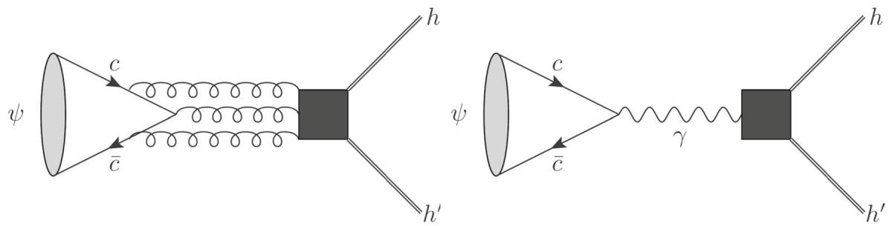
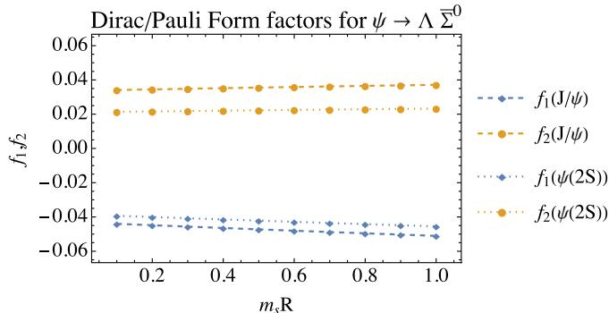
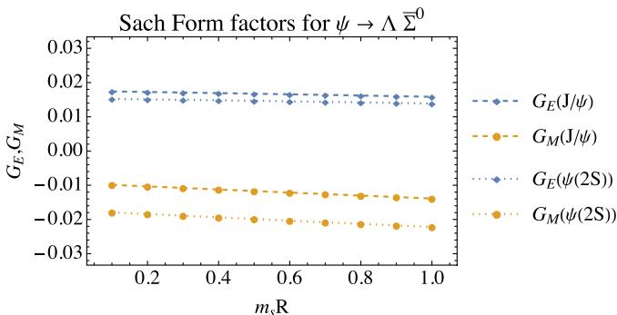
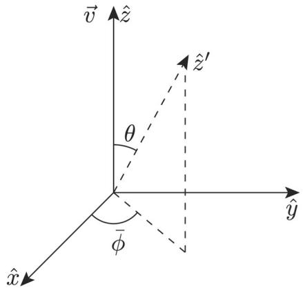
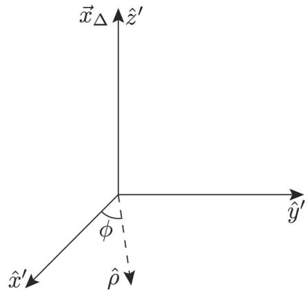

Regular Article - Theoretical Physics

# Isospin violating decays of vector charmonia

# Chao-Qiang Geng1, Chia-Wei Liu2, Jiabao Zhang1,3,a

$^{1}$  School of Fundamental Physics and Mathematical Sciences, Hangzhou Institute for Advanced Study, UCAS, Hangzhou 310024, China  
$^{2}$  Tsung-Dao Lee Institute and School of Physics and Astronomy, Shanghai Jiao Tong University, Shanghai 200240, China  
3 Institute of Theoretical Physics, UCAS, University of Chinese Academy of Sciences, Beijing 100190, China

Received: 23 August 2023 / Accepted: 1 October 2023

© The Author(s) 2023

Abstract We study the isospin violating decays of vector charmonia to  $\Lambda \overline{\Sigma}^0$  and its charge conjugate. They are dominated by the single photon annihilation and can be evaluated reliably with timelike form factors. We utilize the quark-pair creation model, which is valid for the OZI suppressed decays, to evaluate the form factors. We obtain the branching fractions of  $\mathcal{B}(J / \psi \rightarrow \Lambda \overline{\Sigma}^0 + c.c.) = (2.4 \pm 0.4) \times 10^{-5}$  and  $\mathcal{B}(\psi(2S) \rightarrow \Lambda \overline{\Sigma}^0 + c.c.) = (3.0 \pm 0.5) \times 10^{-6}$ , which are compatible with the measurements by the BESIII collaborations, respectively. The decay asymmetries are found to be  $\alpha_{J / \psi} = 0.314$  and  $\alpha_{\psi(2S)} = 0.461$ , which can be examined at BESIII in the foreseeable future.

# 1 Introduction

The decays of vector charmonia  $(\psi)$  into baryon and antibaryon have recently been thoroughly studied at BESIII. On the one hand, the branching fractions and decay asymmetries have been precisely measured [1-5]. On the other hand, since the produced baryon-antibaryon pairs are entangled, their sequential decays are utilized as sensitive probes to CP asymmetries [6-8] generated by new physics (NP) [9-13]. In Table 1, we list the branching fractions  $(\mathcal{B})$  and decay asymmetries  $(\alpha)$  for  $\psi$  decaying to a pair of octet baryon-antibaryons. It is interesting to point out that the measured  $\alpha$  between  $\Sigma \overline{\Sigma}$  and the others differ in sign, suggesting large breaking effects of the SU(3) flavor symmetry [14, 15], which might attribute to NP.

In this work, we focus on the isospin-violating effects. One way to examine them is to compare the differences among the isospin multiplets. Explicitly, the experimental data of  $\mathcal{B}(J / \psi \rightarrow \Xi^{-}\overline{\Xi}^{+} / \Xi^{0}\overline{\Xi}^{0})$  shows a  $10\%$  deviation against the isospin symmetry prediction. To further study the isospin

violation in baryonic decays, the most direct way is to investigate the decays of vector charmonia  $\psi$  to  $\Lambda \overline{\Sigma}^0$  and the corresponding charge conjugates, which explicitly violate the isospin symmetry. In particular, the BESIII collaboration has measured the branching fractions as [16, 17]

$$
\mathcal {B} (J / \psi \rightarrow \Lambda \bar {\Sigma} ^ {0} + c. c) = (2. 8 3 \pm 0. 2 3) \times 1 0 ^ {- 5},
$$

$$
\mathcal {B} (\psi (2 S) \to \Lambda \overline {{\Sigma}} ^ {0} + c. c) = (1. 6 \pm 0. 7) \times 1 0 ^ {- 6},
$$

whereas the CLEO-c collaboration found [18]

$$
\mathcal {B} (\psi (2 S) \rightarrow \Lambda \overline {{\Sigma}} ^ {0} + c. c) = (1. 2 3 \pm 0. 2 4) \times 1 0 ^ {- 5}, \tag {1}
$$

which is almost an order of magnitude larger than the BESIII's measurement. Several theoretical studies have been dedicated to these decay modes [19-26], where the electromagnetic amplitudes are fitted from the experimental data.

Generally speaking, the isospin symmetry can be violated by the electric charge and mass difference between  $u$  and  $d$  quarks. In this work, we only consider the electric charge difference, which is manifested by a single photon exchange amplitude. As we will see later, the amplitudes of  $J / \psi \rightarrow \gamma^{*} \rightarrow hh^{\prime}$  with  $h^{(\prime)}$  an arbitrary hadron can be calculated by the timelike form factors. In this work, we adopt the quark pair creation model (QPC), also known as the  $^3 P_0$  model, to describe the quark-antiquark pair creation from the vacuum [27-30], which may originate from the gluon condensation [31]. The model has been widely used in the OZI-allowed hadronic decays [32-36]. By exploiting it in these OZI-suppressed modes, we provide a direct evaluation of the branching fractions and decay asymmetries of these isospin-violating channels. All of the decay modes considered in this work can be tested at BESIII.

This paper is organized as follows. In Sect. 2, we show the formalisms which combines the homogeneous bag and

Table 1 The Branching fractions and decay asymmetries of  $J/\psi$  and  $\psi \left( {2S}\right)$  to octet baryon-antibaryons  

<table><tr><td></td><td>Channels</td><td>103B</td><td>α</td><td></td><td>Channels</td><td>104B</td><td>α</td></tr><tr><td rowspan="7">J/ψ</td><td>pbar</td><td>2.120(29)</td><td>0.595(19)</td><td>ψ(2S)</td><td>pbar</td><td>2.94(8)</td><td>1.03(7)</td></tr><tr><td>nbar</td><td>2.09(16)</td><td>0.50(21)</td><td></td><td>nbar</td><td>3.06(15)</td><td>0.68(16)</td></tr><tr><td>ΛΔ</td><td>1.89(9)</td><td>0.469(26)</td><td></td><td>ΛΔ</td><td>3.81(13)</td><td>0.824(74)</td></tr><tr><td>Σ0Σ0</td><td>1.172(32)</td><td>-0.449(20)</td><td></td><td>Σ0Σ0</td><td>2.35(9)</td><td>0.71(11)</td></tr><tr><td>Σ+Σ-</td><td>1.07(4)</td><td>-0.5156(68)</td><td></td><td>Σ+Σ-</td><td>2.43(10)</td><td>0.682(32)</td></tr><tr><td>Ξ0Ξ0</td><td>1.17(4)</td><td>0.66(3)</td><td></td><td>Ξ0Ξ0</td><td>2.3(4)</td><td>0.665(118)</td></tr><tr><td>Ξ-Ξ+</td><td>0.98(4)</td><td>0.586(16)</td><td></td><td>Ξ-Ξ+</td><td>2.87(11)</td><td>0.693(69)</td></tr></table>

quark pair creation models. The numerical results are given in Sect. 3. Section 4 is the conclusion.

# 2 Formalism

The leading amplitudes of  $\mathcal{A}(\psi \rightarrow hh^{\prime})$  are classified into three categories:  $\mathcal{A}^{ggg}$ ,  $\mathcal{A}^{\gamma}$  and  $\mathcal{A}^{gg\gamma}$ , where  $\mathcal{A}^X$  represents  $\mathcal{A}(\psi \rightarrow X \rightarrow hh^{\prime})$ . In general, the dominant amplitude is  $\mathcal{A}^{ggg}$  since  $\mathcal{A}^{\gamma} / \mathcal{A}^{ggg} \propto \alpha_{em} / \alpha_s^3 \approx 1/2$  with  $\alpha_{em(s)}$  being the fine structure constant of QED (QCD). Such amplitude is difficult to be evaluated due to the nonperturbative effect of QCD at the charm scale. In the case of the isospin violating decays, the hierarchy is inverted as  $\mathcal{A}^{\gamma} \gg \mathcal{A}^{ggg}$  since the latter is suppressed by the smallness of the mass difference between  $u$  and  $d$  quark. It suffices to consider  $\mathcal{A}^{\gamma}$  solely, as depicted in Fig. 1.

In the following, we will consider the isospin violating decays exclusively and set the quark masses of  $m_{u}$  and  $m_{d}$  to be equivalent. Accordingly, we focus on  $\mathcal{A}^{\gamma}$  and drop its superscript as confusions are not possible, which  $\mathcal{A}^{\gamma}$  is decomposed according to the helicities as3

$$
\mathcal {A} _ {\lambda_ {h} \lambda_ {h ^ {\prime}}} = 4 \pi \alpha Q _ {c} \frac {f _ {\psi}}{M _ {\psi}} \sum_ {q = u, d, s} Q _ {q} M _ {\lambda_ {h} \lambda_ {h ^ {\prime}}} ^ {q},
$$

$$
M _ {\lambda_ {h} \lambda_ {h ^ {\prime}}} ^ {q} = \epsilon_ {\mu} \left\langle \lambda_ {h}; \lambda_ {h ^ {\prime}} \right| \bar {q} \gamma^ {\mu} q | 0 \rangle , \tag {2}
$$

where  $Q_{q}$  is the electric charge of  $q$ ,  $\lambda_{h^{(v)}}$  is the helicity of  $h^{(v)}$ , and  $f_{\psi}, M_{\psi}$  and  $\epsilon_{\mu}$  are the decay constant, mass and polarization vector of  $\psi$ , respectively. As the isospin has to be violated, the conserved parts of the amplitudes vanish, given by

$$
M _ {\lambda_ {h} \lambda_ {h ^ {\prime}}} ^ {u} + M _ {\lambda_ {h} \lambda_ {h ^ {\prime}}} ^ {d} = M _ {\lambda_ {h} \lambda_ {h ^ {\prime}}} ^ {s} = 0, \tag {3}
$$

leading to  $\sum_{q}Q_{q}M_{\lambda_{h}\lambda_{h^{\prime}}}^{q} = M_{\lambda_{h}\lambda_{h^{\prime}}}^{u}$ . The branching fraction of  $\psi \rightarrow hh^{\prime}$  is given as

$$
\mathcal {B} (\psi \rightarrow h h ^ {\prime}) = \frac {1}{3} \frac {| \vec {p} _ {h} |}{8 \pi M _ {\psi} ^ {2} \Gamma_ {\psi}} \sum_ {\lambda_ {h}, \lambda_ {h ^ {\prime}}} | \mathcal {A} _ {\lambda_ {h} \lambda_ {h ^ {\prime}}} | ^ {2}, \tag {4}
$$

where  $\Gamma_{\psi}$  is the total decay width of  $\psi$ ,  $\vec{p}$  is the 3-momentum of  $h$  in the rest frame of  $\psi$ . For  $e^{+}e^{-}\rightarrow \psi \rightarrow hh^{\prime}$ , there is an additional parameter in distributions

$$
\frac {d \Gamma}{d \cos \theta} \propto 1 + \alpha \cos^ {2} \theta , \quad \alpha = \frac {\left| \mathcal {A} _ {T} \right| ^ {2} - 2 \left| \mathcal {A} _ {L} \right| ^ {2}}{\left| \mathcal {A} _ {T} \right| ^ {2} + 2 \left| \mathcal {A} _ {L} \right| ^ {2}}, \tag {5}
$$

where  $(\mathcal{A}_T,\mathcal{A}_L)$  correspond to  $(\mathcal{A}_{+ - },\mathcal{A}_{+ + })$  for  $\psi \rightarrow \Lambda \overline{\Sigma}^0$  and  $\theta$  is the angle between the 3-momenta of  $e^{+}e^{-}$  and  $hh^{\prime}$

In this work, we focus on the baryonic final states  $\Lambda \overline{\Sigma}^0$  and its charge conjugate. The matrix element in Eq. (2) can be further parametrized by the timelike form factors  $(G_E, G_M)$  and  $(f_1, f_2)$  as

$$
\begin{array}{l} M _ {\lambda_ {\Lambda} \lambda_ {\overline {{\Sigma}}} 0} ^ {q} = \epsilon_ {\mu} \bar {u} \left[ G _ {M} (q ^ {2}) \gamma^ {\mu} + \frac {M _ {+}}{q ^ {2}} \left(G _ {M} (q ^ {2}) - G _ {E} (q ^ {2})\right) q ^ {\mu} \right] v, \\ = \epsilon_ {\mu} \bar {u} \left[ f _ {1} \left(q ^ {2}\right) \gamma^ {\mu} + f _ {2} \left(q ^ {2}\right) \frac {i \sigma_ {\mu v} q ^ {v}}{M _ {+}} \right] v, \tag {6} \\ \end{array}
$$

where  $q^{\mu} = p^{\mu} + p^{\prime \mu}$  and  $p^\mu (p^{\prime \mu})$  and  $u(v)$  are the 4-momentum and Dirac spinor of  $\Lambda$ $(\overline{\Sigma}^{0})$ . The form factors are related to the helicity amplitudes as

$$
\mathcal {A} _ {T} = \sqrt {2 \left(M _ {\psi} ^ {2} - M _ {-} ^ {2}\right)} G _ {M} (s), \mathcal {A} _ {L} = \frac {M _ {+}}{M _ {\psi}} \sqrt {M _ {\psi} ^ {2} - M _ {-} ^ {2}} G _ {E} (s). \tag {7}
$$

  
Fig. 1 The quark diagrams of  $\psi \rightarrow hh'$ , where the double lines represent hadrons

In this work, we adopt the homogeneous bag model (HBM) and  $^3 P_0$  model to evaluate the electromagnetic baryonic form factors in the timelike region. Such form factors can be measured with high precision at the BESIII experiment [38], which could provide valuable information for theoretical study.

# 2.1 Homogeneous bag model

In the homogeneous bag model (HBM), a baryon state is constructed by acting quark field operators on the vacuum state, which effectively couples a baryon to quarks by wave functions. We take  $\Lambda$  baryon as an example, given as

$$
\begin{array}{l} \left| \Lambda , \vec {p} = 0, \uparrow \right\rangle = \int \left[ d ^ {3} \vec {x} \right] \frac {1}{\sqrt {6}} \epsilon^ {\alpha \beta \gamma} u _ {a \alpha} ^ {\dagger} (\vec {x} _ {u}) d _ {b \beta} ^ {\dagger} (\vec {x} _ {d}) s _ {c \gamma} ^ {\dagger} (\vec {x} _ {s}) \\ \times \Psi_ {\uparrow [ u d ] s} ^ {a b c} ([ \vec {x} ]) | 0 \rangle , \tag {8} \\ \end{array}
$$

where  $q_{a\alpha}^{\dagger}(\vec{x})$  is the field operator which creates quark  $q$  at position  $\vec{x}$ ,  $a$  and  $\alpha$  are the spinor and color indices, respectively. The three quarks are combined into a baryon by the color and spin-flavor-spatial wave function  $\epsilon^{\alpha \beta \gamma}$  and  $\Psi_{[ud]s}^{abc}$ . We have used the shorthand notation  $[\vec{x}] = (\vec{x}_u,\vec{x}_d,\vec{x}_s)$  and  $[d^3\vec{x}] = d^3\vec{x}_ud^3\vec{x}_dd^3\vec{x}_s$ . The wave function  $\Psi_{\uparrow [ud]s}^{abc}$  for  $\Lambda$  baryon is given as

$$
\begin{array}{l} \Psi_ {\uparrow [ u d ] s} ^ {a b c} ([ \vec {x} ]) = \frac {\mathcal {N} _ {\Lambda}}{\sqrt {2}} \int d ^ {3} \vec {x} \left(\phi_ {u \uparrow} ^ {a} (\vec {x} _ {u} ^ {\prime}) \phi_ {d \downarrow} ^ {b} (\vec {x} _ {d} ^ {\prime}) \right. \\ \left. - \phi_ {u \downarrow} ^ {a} \left(\vec {x} _ {u} ^ {\prime}\right) \phi_ {d \uparrow} ^ {b} \left(\vec {x} _ {d} ^ {\prime}\right)\right) \phi_ {s \uparrow} ^ {c} \left(\vec {x} _ {s} ^ {\prime}\right), \tag {9} \\ \end{array}
$$

where  $\phi$  is the static bag wave function described in Appendix A, the subscript  $[ud]$  indicates the wave function is antisymmetric in swapping  $u$  and  $d$  quarks, and  $\vec{x}_q' = \vec{x}_q - \vec{x}$  is the position of quark  $q$  with respect to the bag center  $\vec{x}$ .

In the original bag model, the hadron state is described by a single bag with its center located at  $\vec{x} = 0$ . However, this configuration is not invariant under Poincaré transformations and thus cannot be considered as an eigenstate of four-momentum. To reconcile the inconsistency, the homogeneous bag model is introduced by duplicating the bag and

distributing homogeneously over the three-dimensional position space  $(\vec{x})$  [39]. By construction, 3-dimensional space points are treated equally in Eq. (12). Such a hadron state is more suitable for describing the decays of hadrons, and has been extensively used in various baryon decays [40-42].

As shown in Eq. (6), the decay of  $\psi \rightarrow \Lambda \overline{\Sigma}^0$  are described by the electromagnetic form factors of  $\Lambda \overline{\Sigma}^0$ . However, the form factors cannot be evaluated even if the hadron wave functions are known. Besides the quark-antiquark pair produced by the photon, two additional pairs of quark-antiquarks are needed in order to form a baryon and an antibaryon. A possible way to calculate the creation matrix element of the baryon-antibaryon pair is to adopt the crossing symmetry on the hadron level [43]. Nevertheless, it is done by assuming the absence of a singularity in form factors. In this paper, we adopt the  $^3 P_0$  model to describe the creation of quark-antiquark pairs. By inserting the  $^3 P_0$  transition operator, the timelike form factors are directly evaluated. Details about this model and our approach can be found in the rest of this section.

# 2.2  $^3 P_0$  model

In the  $^3 P_0$  model, the quark-antiquark pairs are created by the transition operator [44]

$$
T _ {q} = \sqrt {3} \gamma_ {q} \int d ^ {3} \vec {x}: \bar {q} (\vec {x}) q (\vec {x}): \tag {10}
$$

where  $\gamma_{q}$  is a dimensionless parameter that describes the strength of the creation, and  $\sqrt{3}$  is a color factor. The  $^3 P_0$  operator is the simplest effective operator that creates the quark-antiquark pair, which may originate from the fundamental quantum chromodynamics (QCD) interaction between quarks and gluons. The gluon-quark couplings in QCD as well as the condensations are all effectively absorbed into  $\gamma_{q}$  [31]. Therefore, it is reasonable to expect a universal, model-independent strength parameter  $\gamma_{q}$  running with the energy scale as

$$
\gamma_ {q} (\mu) = \frac {\gamma_ {q 0}}{\log \left(\mu / \mu_ {0}\right)}. \tag {11}
$$

In the phenomenological practice, it suffices to fit the parameters  $\gamma_{q0}$  and  $\mu_0$  from various decay experiments, which are adopted from Ref. [44] in this work. We emphasize that  $\gamma_{q}$  shall not depend on hadron wave functions as it essentially describes the creations of (anti)quarks at the quark level.

In the previous literature, the  $^3 P_0$  model is mostly used in the cooperation with the nonrelativistic (NR) hadron wave functions. At the first glance, it may seem that it conflicts with the bag model, which is essentially a relativistic quark model. However, the relativistic corrections in  $\psi \rightarrow \Lambda \overline{\Sigma}^{0}$  are rather small and the HBM has a well-defined NR limit. We also present the results in the NR limit in Sect. 3.

With these phenomenological models, the matrix element is now given as

$$
\begin{array}{l} M _ {\lambda_ {\Lambda} \lambda_ {\overline {{\Sigma}}} 0} ^ {u} = \epsilon_ {\mu} \langle \lambda_ {\Lambda}; \lambda_ {\overline {{\Sigma}}} 0 | \bar {u} \gamma^ {\mu} u T _ {d} T _ {s} | 0 \rangle \\ = 3 \gamma_ {q} ^ {2} \sum_ {[ \lambda ]} N ^ {\lambda_ {\Lambda} \lambda_ {\overline {{\Sigma}}} 0} ([ \lambda ]) \int d ^ {3} \vec {x} _ {\Delta} \Gamma_ {\lambda_ {u} \lambda_ {\bar {u}}} ^ {\lambda_ {\psi}} (\vec {x} _ {\Delta}) \tag {12} \\ \times E _ {\lambda_ {d} \lambda_ {\bar {d}}} (\vec {x} _ {\Delta}) E _ {\lambda_ {s} \lambda_ {\bar {s}}} (\vec {x} _ {\Delta}), \\ \end{array}
$$

where  $[\lambda]$  collects all the quark spins and  $N^{\lambda_{\Lambda}\lambda_{\overline{\Sigma}^{0}}}([ \lambda ])$  is the spin-flavor overlapping. The integration over  $\vec{x}_{\Delta}$  is directly related to the integration over all the bag centers  $\vec{x}$  in Eq. (9), which distinguishes the HBM with the original bag model. The vertex functions of  $\Gamma_{\lambda_u\lambda_{\bar{u}}}^{\psi}$  and  $E_{\lambda_q\lambda_{\bar{q}}}$  correspond to the productions of the quark-antiquark pairs due to the QED vertex and  $T_{q}$ , respectively, given as

$$
\begin{array}{l} \Gamma_ {\lambda_ {u} \lambda_ {\bar {u}}} ^ {\lambda_ {\psi}} (\vec {x} _ {\Delta}) = \int d ^ {3} \vec {x} _ {u} \mathcal {G} _ {\lambda_ {u} \lambda_ {\bar {u}}} ^ {\lambda_ {\psi}} \\ = \int d ^ {3} \vec {x} _ {u} \phi_ {u \lambda_ {u}} ^ {\dagger} \left(\vec {x} _ {u} + \frac {1}{2} \vec {x} _ {\Delta}\right) \Upsilon \tilde {\phi} _ {\tilde {u} \lambda_ {\tilde {u}}} ^ {*} \\ \times \left(\vec {x} _ {u} - \frac {1}{2} \vec {x} _ {\Delta}\right), \tag {13} \\ \end{array}
$$

$$
\begin{array}{l} E _ {\lambda_ {q} \lambda_ {\bar {q}}} (\vec {x} _ {\Delta}) = \int d ^ {3} \vec {x} _ {q} \mathcal {E} _ {\lambda_ {q} \lambda_ {\bar {q}}} \\ = \frac {1}{\gamma} \int d ^ {3} \vec {x} _ {q} \phi_ {q \lambda_ {q}} ^ {\dagger} \left(\vec {x} _ {q} + \frac {1}{2} \vec {x} _ {\Delta}\right) \mathcal {S} \tilde {\phi} _ {\bar {q} \lambda_ {\bar {q}}} ^ {*} \\ \times \left(\vec {x} _ {q} - \frac {1}{2} \vec {x} _ {\Delta}\right), \\ \end{array}
$$

where  $\Upsilon = S_{v}\gamma^{0}\epsilon_{\mu}\gamma^{\mu}S_{-v},S\equiv S_{v}\gamma^{0}S_{-v}$  and  $S_{\pm v} =$ $(\sqrt{\gamma + 1}\pm \sqrt{\gamma - 1}\gamma^{0}\gamma^{3}) / \sqrt{2}$  boost the wave function towards  $\pm z$  direction,4 and  $\tilde{\phi}$  is the charge conjugation of the wave function  $\phi$  . Note that there is no spectator quark, which clearly differs from the form factors at the spacelike

region. Besides, without introducing  $^3 P_0$  operators, we have  $S = 1$  in Eq. (13), leading to vanishing  $E_{\lambda_q\lambda_{\bar{q}}}(\vec{x}_{\Delta})$  for arbitrary spin configurations.

As we can see from Eqs. (12) and (13), one has to perform a twelve-fold integral to obtain the final result. After choosing the appropriate coordinates for different integrals, we manage to reduce the complexity of the calculation significantly, described in Appendix A. By plugging Eq. (A1), we find that

$$
\begin{array}{l} \mathcal {A} _ {T} = \mathcal {C} _ {B} \left\langle 2 \Gamma_ {- -} ^ {+} E _ {+ -} ^ {d} E _ {+ +} ^ {s} - \Gamma_ {- +} ^ {+} E _ {+ -} ^ {d} E _ {+ -} ^ {s} \right. \\ + \Gamma_ {+ -} ^ {+} E _ {- +} ^ {d} E _ {+ -} ^ {s} - 2 \Gamma_ {+ -} ^ {+} E _ {- -} ^ {d} E _ {+ +} ^ {s}), \\ \end{array}
$$

$$
\mathcal {A} _ {L} = \mathcal {C} _ {B} \left\langle - 2 \Gamma_ {- +} ^ {0} E _ {+ +} ^ {d} E _ {+ -} ^ {s} + 2 \Gamma_ {+ +} ^ {0} E _ {- +} ^ {d} E _ {+ -} ^ {s} \right\rangle ,
$$

$$
\mathcal {C} _ {B} = 4 \pi \alpha Q _ {c} \frac {f _ {\psi}}{M _ {\psi}} 3 \gamma_ {q} ^ {2} \mathcal {N} _ {\Lambda} \mathcal {N} _ {\bar {\Sigma} ^ {0}} \frac {1}{2 \sqrt {3}}, \tag {14}
$$

where  $\mathcal{N}$  is the normalization constant and  $\langle \dots \rangle$  stand for  $\int d^3\vec{x}_{\Delta}$ .

# 3 Numerical results

We extract  $f_{\psi}$  through the experiments of  $\mathcal{B}(\psi \to e^{+}e^{-})$  and find that  $f_{J / \psi} = 416 \, \mathrm{MeV}$  and  $f_{\psi (2S)} = 294 \, \mathrm{MeV}$ . The bag radius of  $\Lambda$  and  $\overline{\Sigma}^0$  are taken to be  $5 \, \mathrm{GeV}^{-1}$ . The running of  $\gamma_q(\mu)$  is taken from Ref. [44], fitted from the decay widths of heavy mesons, where  $\mu$  is the energy scale. To be conservative, we consider  $10\%$  variations of  $\mu$ , leading to  $\gamma_q = 0.295(14)$  for  $J / \psi$  and 0.278(13) for  $\psi (2S)$ .

Remarkably, the numerical results depend little on the bag radius. The numerical results of the timelike form factors  $(G_{E}, G_{M})$  and  $(f_{1}, f_{2})$  are listed in Table 2. There are only two dimensionful parameters in the model, which correspond to the bag radius  $R$  and the strange quark mass  $m_{s}$ . The form factors are dimensionless and thus depend only on  $m_{s}R$ , which vanishes in the  $SU(3)_F$  limit. We plot the form factors versus  $m_{s}R$  in Fig. 2, which shows slight dependency.

In Table 3, we present the branching fractions and decay asymmetries. The dependence on  $\gamma_{q}$  is canceled in  $\alpha_{\psi}$ , leading to negligible uncertainties on  $\alpha_{\psi}$ .

The predicted  $\mathcal{B}$  of  $J / \psi \rightarrow \Lambda \overline{\Sigma}^{0} + c.c.$  is consistent with the BESIII measurements, whereas the ones of  $\psi (2S)$  sits between the experimental measurements at the BESIII [17] and CLEO [18] collaborations. From Table 2, we can see that  $|G_{M}|$  for  $\psi (2S)$  is larger than that for  $J / \psi$  , which contradicts the common belief that form factors should decrease as  $q^2$  increases. In this work, we consider two scenarios. In Table 3, the upper row results of  $\psi (2S)$  are evaluated by taking  $G_{E,M}(M_{\psi (2S)}^2) = G_{E,M}(M_{J / \psi}^2)$  , while the lower row results by calculating directly within the  $^3 P_0$  model. The first scenario favors  $\mathcal{B}$  measured at BESIII, while the second at CLEO-c. We note that the branching ratio between  $J / \psi$

Table 2 The form factors for  $J / \psi ,\psi (2S)\to \Lambda \overline{\Sigma}^{0}$  

<table><tr><td></td><td>GE(M2ψ)</td><td>GM(M2ψ)</td><td>f1(M2ψ)</td><td>f2(M2ψ)</td></tr><tr><td>J/ψ</td><td>0.0151(14)</td><td>-0.0155(15)</td><td>-0.0538(51)</td><td>0.0383(36)</td></tr><tr><td>ψ(2S)</td><td>0.0132(12)</td><td>-0.0239(22)</td><td>-0.0479(45)</td><td>0.0240(22)</td></tr></table>

  
Fig. 2 The form factors of  $\psi \rightarrow \Lambda \overline{\Sigma}^0$  versus the dimensionless parameter  $m_sR$  from the HBM

Table 3 The branching fractions and decay asymmetries of  $\psi \rightarrow hh^{\prime}$  

<table><tr><td rowspan="2">Channels</td><td colspan="2">105B</td><td rowspan="2">αψThis work</td></tr><tr><td>Exp.</td><td>This work</td></tr><tr><td>J/ψ → ΛΣ0+ c.c.</td><td>2.83 ± 0.23 [16]</td><td>2.40 ± 0.40</td><td>0.314</td></tr><tr><td>ψ(2S) → ΛΣ0+ c.c.</td><td>0.16 ± 0.07 [17]</td><td>0.30 ± 0.05</td><td>0.461</td></tr><tr><td></td><td>1.23 ± 0.24 [18]</td><td>0.75 ± 0.13</td><td>0.786</td></tr></table>

and  $\psi (2S)$  in the first scenario is compatible with the naive expectation of  $\mathcal{B}_{\psi (2S)}^{ee} / \mathcal{B}_{J / \psi}^{ee}\approx 13\%$  with  $\mathcal{B}_{\psi}^{ee}$  the branching fraction of  $\psi \rightarrow e^{+}e^{-}$ .

To examine the results, we consider the nonrelativistic (NR) limit by taking  $m_q\to \infty$  .As a result, the terms in Eq. (14) with  $E_{\pm \mp}$  vanish in the NR limit, resulting in  $\mathcal{A}_T =$ $\mathcal{C}_B\langle -2\Gamma_{+-}^+ E_{--}^d E_{++}^s\rangle ,\mathcal{A}_L = 0.$  Note that this is indeed the interpretation of the  $^3 P_0$  quantum number, in which the created  $q\bar{q}$  has the spin configuration of  $|\uparrow \downarrow +\downarrow \uparrow \rangle$  .When the relativistic corrections are included, other spin configurations also contribute, leading to the amplitude shown in Eq. (14).

# 4 Conclusions

In this work, we study the isospin violating decays of vector charmonia  $\psi$  in both baryonic and mesonic sectors. Such decays are attributed to the single photon annihilation and suppressed by the OZI rule. We utilize the  $^3 P_0$  model to calculate the timelike form factors.

The branching fractions of  $\psi \rightarrow \Lambda \overline{\Sigma}^0 + c.c.$  are predicted as  $2.4(4) \times 10^{-5}$  for  $J / \psi$  and  $0.30(5) \times 10^{-5}$  for  $\psi(2S)$ , which are both consistent with the experimental measurements at BESIII. For the decay asymmetries, we

predict  $\alpha_{J / \psi} = 0.314$  and  $\alpha_{\psi (2S)} = 0.461$  for  $\psi \rightarrow \Lambda \overline{\Sigma}^0$  which can be tested at BESIII in the foreseeable future.

Acknowledgements We would like to express our sincere appreciation to Prof. Xiaorong Zhou and Zekun Jia for their valuable insights during the development of this work. This work is supported in part by the National Key Research and Development Program of China under Grant No. 2020YFC2201501 and the National Natural Science Foundation of China (NSFC) under Grant No. 12147103 and 12205063.

Data availability statement This manuscript has no associated data or the data will not be deposited. [Authors' comment: All data generated or analyzed during this study are included in this published article].

Open Access This article is licensed under a Creative Commons Attribution 4.0 International License, which permits use, sharing, adaptation, distribution and reproduction in any medium or format, as long as you give appropriate credit to the original author(s) and the source, provide a link to the Creative Commons licence, and indicate if changes were made. The images or other third party material in this article are included in the article's Creative Commons licence, unless indicated otherwise in a credit line to the material. If material is not included in the article's Creative Commons licence and your intended use is not permitted by statutory regulation or exceeds the permitted use, you will need to obtain permission directly from the copyright holder. To view a copy of this licence, visit http://creativecommons.org/licenses/by/4.0/.

Funded by  $\mathrm{SCOAP^3}$ .  $\mathrm{SCOAP^3}$  supports the goals of the International Year of Basic Sciences for Sustainable Development.

# Appendix A: Wave functions and bag integrals in HBM

The quark and antiquark bag wave functions are given as

$$
\phi_ {q} = \left( \begin{array}{c} u \chi \\ i v \hat {r} \cdot \vec {\sigma} \chi \end{array} \right), \tilde {\phi} _ {\bar {q}} = i \gamma^ {2} \phi_ {q}, \tag {A1}
$$

respectively, where  $u = \sqrt{E_q + m_q} j_0(p_q r)$ ,  $v = \sqrt{E_q - m_q} j_1(p_q r)$ ,  $\chi$  is the usual Pauli spinor, with  $E_{q} = \sqrt{m_{q}^{2} + p_{q}^{2}}$ ,  $\chi_{\uparrow} = (1,0)^T$  and  $\chi_{\downarrow} = (0,1)^T$ . The spatial distributions are governed by the zeroth and first spherical Bessel functions of  $j_{0,1}(p_q r)$ , where  $p_q$  is the quantized 3-momentum

$$
\tan \left(p _ {q} R\right) = \frac {p _ {q} R}{1 - m _ {q} R - E _ {q} R}, \tag {A2}
$$

and  $R$  is the bag radius of the hadron, fitted from the mass spectrum.

We adopt the following normalization condition for the baryon states

$$
\left\langle \vec {\Lambda}, \lambda_ {\Lambda} \mid \vec {\Lambda} ^ {\prime}, \lambda_ {\Lambda} ^ {\prime} \right\rangle = u _ {\Lambda} ^ {\dagger} u _ {\Lambda} ^ {\prime} (2 \pi) ^ {3} \delta^ {3} \left(\vec {p} _ {\Lambda} - \vec {p} _ {\Lambda} ^ {\prime}\right), \tag {A3}
$$

where  $u_{\Lambda}, \lambda_{\Lambda}$  are the spinor and the spin of the  $\Lambda$  baryon, its normalization factor is found to be

$$
\mathcal {N} _ {\Lambda} = \left(\frac {1}{\bar {u} _ {\Lambda} u _ {\Lambda}} \int d ^ {3} \vec {x} _ {\Delta} \prod_ {q = u, d, s} D ^ {q} (\vec {x} _ {\Delta})\right) ^ {- 1 / 2}, \tag {A4}
$$

with

$$
\begin{array}{l} D ^ {q} (\vec {x} _ {\Delta}) = \int d ^ {3} \vec {x} _ {q} \mathcal {D} ^ {q} \\ = \int d ^ {3} \vec {x} _ {q} \phi_ {q} ^ {\dagger} \left(\vec {x} _ {q} + \frac {1}{2} \vec {x} _ {\Delta}\right) \phi_ {q} \left(\vec {x} _ {q} - \frac {1}{2} \vec {x} _ {\Delta}\right). \tag {A5} \\ \end{array}
$$

Note that  $D^{q}(\vec{x}_{\Delta})$  is independent of the velocity and spin of the baryon.

To evaluate Eqs. (13) and (A5), we use the coordinate shown in Fig. 3, where  $\hat{z}$  and  $\hat{z}'$  are chosen to be parallel to  $\vec{v}$

and  $\vec{x}_{\Delta}$ , respectively. By changing the integration variables from  $d^3\vec{x}_q$  to  $d\rho dz'd\phi$  and integrating over  $d\phi$ , we arrive at

$$
\begin{array}{l} \int \mathcal {D} ^ {q} \mathrm {d} \phi = 2 \pi \left(\mathcal {E} _ {2} + \mathcal {E} _ {3} + 2 \mathcal {E} _ {4}\right), (A6) \\ \int \mathcal {E} _ {\pm \mp} \mathrm {d} \phi = \mp 2 \pi e ^ {\mp i \tilde {\phi}} \sin \theta (i \mathcal {E} _ {1} + 2 v \cos \theta \mathcal {E} _ {3} - 2 v \cos \theta \mathcal {E} _ {4}), \\ \int \mathcal {E} _ {\pm \pm} \mathrm {d} \phi = 2 \pi (i \cos \theta \mathcal {E} _ {1} + v \mathcal {E} _ {2} + v \cos 2 \theta \mathcal {E} _ {3} - 2 v \cos^ {2} \theta \mathcal {E} _ {4}), (A7) \\ \end{array}
$$

$$
\int \mathcal {G} _ {\pm \mp} ^ {\pm} \mathrm {d} \phi = 2 \sqrt {2} \pi \gamma \left[ i v \cos \theta \mathcal {E} _ {1} + \mathcal {E} _ {2} + \cos^ {2} \theta \mathcal {E} _ {3} + \sin^ {2} \theta \mathcal {E} _ {4} \right],
$$

$$
\int \mathcal {G} _ {\mp \pm} ^ {\pm} \mathrm {d} \phi = 2 \sqrt {2} \pi \gamma e ^ {\pm 2 i \tilde {\phi}} \sin^ {2} \theta (\mathcal {E} _ {3} - \mathcal {E} _ {4}),
$$

$$
\begin{array}{l} \int \mathcal {G} _ {\pm \pm} ^ {\pm} \mathrm {d} \phi = \int \mathcal {G} _ {\mp \pm} ^ {\pm} \mathrm {d} \phi = \sqrt {2} \pi \gamma e ^ {\pm i \tilde {\phi}} \sin \theta \\ \times [ \pm i v \mathcal {E} _ {1} + 2 \cos \theta (\mathcal {E} _ {3} - \mathcal {E} _ {4}) ], \\ \end{array}
$$

$$
\begin{array}{l} \int \mathcal {G} _ {\pm \mp} ^ {3} \mathrm {d} \phi = \mp 2 \pi e ^ {\mp i \bar {\phi}} \sin 2 \theta \left(\mathcal {E} _ {3} - \mathcal {E} _ {4}\right), \\ \int \mathcal {G} _ {\pm \pm} ^ {3} \mathrm {d} \phi = 2 \pi (- \mathcal {E} _ {2} + \cos 2 \theta \mathcal {E} _ {3} - 2 \cos^ {2} \theta \mathcal {E} _ {4}),. \tag {A8} \\ \end{array}
$$

where

$$
\begin{array}{l} \mathcal {E} _ {1} = \frac {z _ {-}}{r _ {-}} u ^ {+} v ^ {-} - \frac {z _ {+}}{r _ {+}} u ^ {-} v ^ {+}, \qquad \mathcal {E} _ {2} = u ^ {+} u ^ {-}, \\ \mathcal {E} _ {3} = z _ {+} z _ {-} \frac {v ^ {+} v ^ {-}}{r _ {+} r _ {-}}, \quad \mathcal {E} _ {4} = \frac {1}{2} \rho^ {2} \frac {v ^ {+} v ^ {-}}{r _ {+} r _ {-}}, \tag {A9} \\ \end{array}
$$

$u^{\pm} = u(\vec{x}\pm \vec{x}_{\Delta} / 2),v^{\pm} = v(\vec{x}\pm \vec{x}_{\Delta} / 2),z_{\pm} = z\pm |\vec{x}_{\Delta}| / 2$  and  $r_{\pm} = \sqrt{z_{\pm}^{2} + \rho^{2}}$

To obtain  $N^{\lambda_{\Lambda}\lambda_{\overline{\Sigma}^{0}}}$ , the spin-flavor parts of  $\Lambda$  and  $\overline{\Sigma}^{0}$  wave functions are

$$
\begin{array}{l} \left| \overline {{\Sigma}} ^ {0}, \uparrow \right\rangle = \frac {1}{\sqrt {6}} \left(- s _ {\uparrow} d _ {\downarrow} u _ {\uparrow} - s _ {\uparrow} d _ {\uparrow} u _ {\downarrow} + 2 s _ {\downarrow} d _ {\uparrow} u _ {\uparrow}\right) \left| 0 \right\rangle , \\ | \overline {{\Sigma}} ^ {0}, \downarrow \rangle = \frac {1}{\sqrt {6}} \left(s _ {\downarrow} d _ {\uparrow} u _ {\downarrow} + s _ {\downarrow} d _ {\downarrow} u _ {\uparrow} - 2 s _ {\uparrow} d _ {\downarrow} u _ {\downarrow}\right) | 0 \rangle , \\ | \Lambda , \updownarrow \rangle = \frac {1}{\sqrt {2}} \left(d _ {\downarrow} ^ {\dagger} u _ {\uparrow} ^ {\dagger} - d _ {\uparrow} ^ {\dagger} u _ {\downarrow} ^ {\dagger}\right) s _ {\updownarrow} ^ {\dagger} | 0 \rangle . \tag {A10} \\ \end{array}
$$

Plugging them into Eq. (12), we find

$$
\begin{array}{l} \mathcal {A} _ {T} \propto \frac {1}{2 \sqrt {3}} \left\langle - \Gamma_ {- -} ^ {+} E _ {+ +} ^ {d} E _ {+ -} ^ {s} + 2 \Gamma_ {- -} ^ {+} E _ {+ -} ^ {d} E _ {+ +} ^ {s} - \Gamma_ {- +} ^ {+} E _ {+ -} ^ {d} E _ {+ -} ^ {s} \right. \\ + \Gamma_ {+ -} ^ {+} E _ {- +} ^ {d} E _ {+ -} ^ {s} - 2 \Gamma_ {+ -} ^ {+} E _ {- -} ^ {d} E _ {+ +} ^ {s} + \Gamma_ {+ +} ^ {+} E _ {- -} ^ {d} E _ {+ -} ^ {s}), \\ \end{array}
$$

$$
\begin{array}{l} \mathcal {A} _ {L} \propto \frac {1}{2 \sqrt {3}} \langle + \Gamma_ {- +} ^ {0} E _ {+ -} ^ {d} E _ {+ +} ^ {s} + \Gamma_ {- - } ^ {0} E _ {+ +} ^ {d} E _ {+ +} ^ {s} - 2 \Gamma_ {- +} ^ {0} E _ {+ +} ^ {d} E _ {+ -} ^ {s} \\ - \Gamma_ {+ +} ^ {0} E _ {- -} ^ {d} E _ {+ +} ^ {s} - \Gamma_ {+ -} ^ {0} E _ {- +} ^ {d} E _ {+ +} ^ {s} + 2 \Gamma_ {+ +} ^ {0} E _ {- +} ^ {d} E _ {+ -} ^ {s} \rangle . \tag {A11} \\ \end{array}
$$

Due to the parity conservation, the amplitudes are invariant under the transformation  $(\lambda_{\psi},\lambda_q,\lambda_{\overline{q}})\to (-\lambda_{\psi}, - \lambda_q, - \lambda_{\overline{q}})$

  
Fig. 3 The cylindrical coordinate, where  $\hat{z}$  and  $\hat{z}^{\prime}$  are chosen to be parallel to  $\vec{v}$  and  $\vec{x}_{\Delta}$ , respectively

# leading to

$$
\langle - \Gamma_ {- -} ^ {+} E _ {+ +} ^ {u} E _ {+ -} ^ {s} + \Gamma_ {+ +} ^ {+} E _ {- -} ^ {u} E _ {+ -} ^ {s} \rangle = 0,
$$

$$
\langle - \Gamma_ {+ +} ^ {0} E _ {- -} ^ {u} E _ {+ +} ^ {s} + \Gamma_ {- -} ^ {0} E _ {+ +} ^ {u} E _ {+ +} ^ {s} \rangle = 0,
$$

$$
\left\langle - \Gamma_ {+ -} ^ {0} E _ {- +} ^ {u} E _ {+ +} ^ {s} + \Gamma_ {- +} ^ {0} E _ {+ -} ^ {u} E _ {+ +} ^ {s} \right\rangle = 0. \tag {A12}
$$

# References

1. M. Ablikim et al., BESIII. Phys. Lett. B 770, 217-225 (2017)  
2. M. Ablikim et al., BESIII. Phys. Rev. Lett. 125, 052004 (2020)  
3. M. Ablikim et al., BESIII. Phys. Rev. D 95, 052003 (2017)  
4. M. Ablikim et al., BESIII. Phys. Rev. D 106, L091101 (2022)  
5. M. Ablikim et al., [BESIII], arXiv:2302.09767, arXiv:2302.13568, arXiv:2304.14655  
6. M. Ablikim et al., BESIII. Nature Phys. 15, 631-634 (2019)  
7. M. Ablikim et al., BESIII. Phys. Rev. Lett. 129, 131801 (2022)  
8. X.G. He, J.P. Ma, Phys. Lett. B 839, 137834 (2023)  
9. M. Ablikim et al., BESIII. Phys. Lett. B 838, 137698 (2023)  
10. M. Ablikim et al., BESIII. Phys. Lett. B 839, 137785 (2023)  
11. M. Ablikim et al., BESIII. Phys. Rev. D 105, 012008 (2022)  
12. M. Ablikim et al., BESIII. Phys. Rev. D 106, 072008 (2022)  
13. M. Ablikim et al., BESIII. Sci. China Phys. Mech. Astron. 66, 221011 (2023)  
14. M. Alekseev, A. Amoroso, R.B. Ferroli, I. Balossino, M. Bertani, D. Bettoni, F. Bianchi, J. Chai, G. Cibinetto, F. Cossio et al., Chin. Phys. C 43, 023103 (2019)  
15. H. Chen, R.G. Ping, Phys. Lett. B 644, 54-58 (2007)  
16. M. Ablikim et al., BESIII. Phys. Rev. D 86, 032008 (2012)  
17. M. Ablikim et al., BESIII. Phys. Rev. D 103, 112004 (2021)  
18. S. Dobbs, K.K. Seth, A. Tomaradze, T. Xiao, G. Bonvicini, Phys. Rev. D 96, 092004 (2017)  
19. M. Claudson, S.L. Glashow, M.B. Wise, Phys. Rev. D 25, 1345 (1982)  
20. K. Zhu, X.H. Mo, C.Z. Yuan, Int. J. Mod. Phys. A 30, 1550148 (2015)

21. R.B. Ferroli, A. Mangoni, S. Pacetti, Eur. Phys. J. C 80, 903 (2020)  
22. D.H. Wei, J. Phys. G 36, 115006 (2009)  
23. J. Jiao, [BESIII], PoS CHARM2016, 046 (2016)  
24. N. Kivel, Eur. Phys. J. A 58, 138 (2022)  
25. A. Mangoni, arXiv:2202.08542  
26. R. Baldini Ferroli, A. Mangoni, S. Pacetti, K. Zhu, Phys. Lett. B 799, 135041 (2019)  
27. L. Micu, Nucl. Phys. B 10, (1969)  
28. A. Le Yaouanc, L. Oliver, O. Pene, J. C. Raynal, Phys. Rev. D 8, (1973)  
29. E.S. Ackleh, T. Barnes, E.S. Swanson, Phys. Rev. D 54, 6811-6829 (1996)  
30. Y.A. Simonov, Phys. Rev. D 84, 065013 (2011)  
31. H.J. Weber, Phys. Lett. B 218, 267-271 (1989)  
32. C. Chen, X.L. Chen, X. Liu, W.Z. Deng, S.L. Zhu, Phys. Rev. D 75, 094017 (2007)  
33. H.W. Ke, Y.Z. Chen, X.Q. Li, Chin. Phys. Lett. 28, 071301 (2011)  
34. T. Wang, G.L. Wang, H.F. Fu, W.L. Ju, JHEP 07, 120 (2013)  
35. K. Gong, H.Y. Jing, A. Zhang, Eur. Phys. J. C 81, 467 (2021)  
36. H. Garcia-Tecocoatzi, A. Giachino, J. Li, A. Ramirez-Morales, E. Santopinto, arXiv:2205.07049  
37. R. L. Workman et al. [Particle Data Group], PTEP 2022, 083C01 (2022)  
38. L. Xia, C. Rosner, Y.D. Wang, X. Zhou, F.E. Maas, R.B. Ferroli, H. Hu, G. Huang, Symmetry 14(2), 231 (2022)  
39. C. W. Liu, C. Q. Geng, arXiv:2205.08158  
40. C.Q. Geng, C.W. Liu, T.H. Tsai, Phys. Rev. D 102, 034033 (2020)  
41. J. Zhang, X.N. Jin, C.W. Liu, C.Q. Geng, Phys. Rev. D 107, 033004 (2023)  
42. C.Q. Geng, X.N. Jin, C.W. Liu, X. Yu, A.W. Zhou, Phys. Lett. B 839, 137831 (2023)  
43. X.N. Jin, C.W. Liu, C.Q. Geng, Phys. Rev. D 105(5), 053005 (2022)  
44. J. Segovia, D.R. Entem, F. Fernández, Phys. Lett. B 715, 322-327 (2012)  
45. J.P. Lees et al., BaBar. Phys. Rev. D 86, 012008 (2012)  
46. M. Ablikim, J.Z. Bai, Y. Bai, Y. Ban, X. Cai, H.F. Chen, H.S. Chen, H.X. Chen, J.C. Chen, J. Chen et al., Phys. Lett. B 693, 88-94 (2010)