# Anatomy of  $\Lambda_c^+$  semileptonic decays

Chao-Qiang Geng,\* Xiang-Nan Jin,\+ and Chia-Wei Liu

School of Fundamental Physics and Mathematical Sciences, Hangzhou Institute for Advanced Study,

UCAS, 310024 Hangzhou, China

and University of Chinese Academy of Sciences, 100190 Beijing, China

(Received 22 December 2022; accepted 13 February 2023; published 24 February 2023)

We present a systematic study of  $\Lambda_c^+ \to \mathcal{B}_q\ell^+\nu_\ell$  with  $\mathcal{B}_q = (\Lambda, n)$  and  $\ell = (e, \mu)$ , examining all the possible decay observables based on the homogeneous bag model (HBM) and lattice QCD (LQCD). With the HBM, we find that the branching fractions and polarization asymmetries of the daughter baryon  $\Lambda$  are  $\mathcal{B}(\Lambda_c^+ \to \Lambda e^+ \nu_e, \Lambda \mu^+ \nu_\mu, n\ell^+ \nu_\ell) = (3.78 \pm 0.25, 3.67 \pm 0.23, 0.40 \pm 0.04)\%$  and  $\alpha_{\Lambda}(\Lambda_c^+ \to \Lambda e^+ \nu_e, \Lambda \mu^+ \nu_\mu) = (-82.6, -82.3)\%$ , respectively. From the LQCD, we obtain that  $\alpha_{\Lambda}(\Lambda_c^+ \to \Lambda e^+ \nu_e, \mu^+ \nu_\mu) = (-87.4 \pm 1.0, -87.2 \pm 1.0)\%$ . We also explore the time-reversal asymmetries due to new physics beyond the standard model. All our results are consistent with the current experimental data, while some of them are accessible to the experiments at BESIII and Belle II.

DOI: 10.1103/PhysRevD.107.033008

# I. INTRODUCTIONS

Very recently, the BESIII [1] Collaboration has reported the decay branching fraction of  $\Lambda_c^+ \to \Lambda e^+ \nu_e$  to be

$$
\mathcal {B} \left(\Lambda_ {c} ^ {+} \rightarrow \Lambda e ^ {+} \nu_ {e}\right) = (3.56 \pm 0.11 \pm 0.07) \%, \tag{1}
$$

which is the most precise measurement in the heavy baryon semileptonic decays to date, providing an excellent opportunity to examine the standard model (SM) and various specific quark models. On the other hand, the polarization asymmetry of the daughter baryon  $\Lambda$  ( $\alpha_{\Lambda}$ ) was measured nearly 20 years ago at CLEO [2], given by

$$
\alpha_ {\Lambda} \left(\Lambda_ {c} ^ {+} \rightarrow \Lambda e ^ {+} \nu_ {e}\right) = (- 0.86 \pm 0.03 \pm 0.02) \% . \tag{2}
$$

It is reasonable to expect that some angular observables including  $\alpha_{\Lambda}$  can be soon measured at BESIII and Belle II. In the view of the recent experiments of  $\Lambda_c^+$  at BESIII [3-8], the strange charmed baryons at Belle [9-12], and the doubly charmed baryons at LHCb [13], there is no doubt that the era of the precision measurements in the charm baryons has begun.

On the theoretical side, the charmed baryons have also been considered with great interest recently [14-21]; see

Ref. [22] for a review. In particular, due to the clean theoretical background,  $\Lambda_c^+ \to \mathcal{B}_q\ell^+\nu_\ell$  with  $\mathcal{B}_q = (\Lambda ,n)$  and  $\ell = (e,\mu)$  are widely studied in the literature [23,24], including the lattice QCD (LQCD) [25-28], light-front quark model (LFQM) [29-31], and  $SU(3)$  flavor  $[SU(3)_F]$  symmetry [32,33]. However, there are some tensions. For instance, the branching fractions of  $\Lambda_c^+ \to \Lambda \ell^+\nu_\ell$  based on the LFQM in Refs. [29-31] deviate by a factor of 2. Clearly, a different angle in analyzing  $\Lambda_c^+ \to \mathcal{B}_q\ell^+\nu$  may shed light on the problem.

In this paper, we concentrate on the decays of  $\Lambda_c^+ \to \mathcal{B}_q\ell^+\nu$  with the bag model (BM) and LQCD. We compute all the possible decay observables of  $\Lambda_c^+ \to \mathcal{B}_q\ell^+\nu$  in the SM and discuss some of the possible effects from new physics (NP). In particular, we discuss the time-reversal (T) asymmetries. As these asymmetries are contaminated little by the hadronic uncertainties, they provide a reliable way to probe NP.

This work is organized as follows. In Sec. II, we give the baryon wave functions and helicity amplitudes from the homogeneous BM (HBM). In Sec. III, we present the angular distributions and extract the physical observables in  $\Lambda_c^+ \to \mathcal{B}_q\ell^+\nu$ . In Sec. IV, we study the T asymmetries from NP. Finally, we conclude this study in Sec. V.

# II. BARYON WAVE FUNCTIONS AND HELICITY AMPLITUDES

The amplitudes of  $\Lambda_c^+ \to \mathcal{B}_q\ell^+\nu$  are given as

$$
\frac {G _ {F}}{\sqrt {2}} V _ {c q} g ^ {\mu \nu} \bar {v} \gamma_ {\mu} (1 - \gamma_ {5}) u \langle \mathcal {B} _ {q} | \bar {q} \gamma_ {\nu} (1 - \gamma_ {5}) c | \Lambda_ {c} \rangle , \tag {3}
$$

Published by the American Physical Society under the terms of the Creative Commons Attribution 4.0 International license. Further distribution of this work must maintain attribution to the author(s) and the published article's title, journal citation, and DOI. Funded by SCOAP3.

where  $V_{cs} = 0.973$  and  $V_{cd} = 0.221$  are the Cabibbo-Kobayashi-Maskawa quark mixing matrix elements [34],  $G_{F}$  is the Fermi constant,  $q = (s,d)$  for  $\mathcal{B}_q = (\Lambda ,n)$ , and  $\bar{\nu}$  and  $u$  are the Dirac spinors of  $\nu$  and  $\ell^{+}$ , respectively. We expand the Minkowski metric  $g^{\mu \nu}$  by

$$
g ^ {\mu \nu} = \varepsilon_ {t} ^ {\mu} (q) \varepsilon_ {t} ^ {* \nu} (q) - \sum_ {\lambda = 0, \pm} \varepsilon_ {\lambda} ^ {\mu} (q) \varepsilon_ {\lambda} ^ {* \nu} (q), \tag {4}
$$

where  $\varepsilon$  and  $q$  are the polarization vector and four-momentum of the off-shell  $W$  boson  $(W^{*})$ , respectively, and the subscript in  $\varepsilon$  denotes the helicity of  $W^{*}$ . In the center of frames of  $W^{*}$  and  $\Lambda_{c}^{+}$ , we have [35]

$$
\varepsilon_ {\pm} ^ {\mu} = \frac {1}{\sqrt {2}} (0, \pm 1, i, 0) ^ {T}, \qquad \varepsilon_ {0} ^ {\mu} = (0, 0, 0, - 1) ^ {T},
$$

$$
\varepsilon_ {t} ^ {\mu} = (- 1, 0, 0, 0) ^ {T}, \tag {5}
$$

and

$$
\begin{array}{l} \varepsilon_ {\pm} ^ {\mu} = \frac {1}{\sqrt {2}} (0, \mp 1, i, 0) ^ {T}, \qquad \varepsilon_ {0} ^ {\mu} = \frac {1}{\sqrt {q ^ {2}}} (- | \vec {q} |, 0, 0, q ^ {0}) ^ {T}, \\ \varepsilon_ {t} ^ {\mu} = \frac {- 1}{\sqrt {q ^ {2}}} q ^ {\mu}, \tag {6} \\ \end{array}
$$

respectively. We note that, in the calculations, we always choose the three-momentum of the outgoing fermion toward the  $\hat{z}$  direction.

By inserting Eq. (4) into Eq. (3), the three-body problem is reduced to a product of the two-body ones, given by

$$
\frac {G _ {F}}{\sqrt {2}} V _ {c q} \left(L _ {t} B _ {t} - \sum_ {\lambda = 0, \pm} L _ {\lambda} B _ {\lambda}\right) \tag {7}
$$

along with

$$
\begin{array}{l} L _ {\lambda_ {W}} = \varepsilon_ {\lambda_ {W}} ^ {\mu} \bar {v} _ {\ell} \gamma_ {\mu} (1 - \gamma_ {5}) u, \\ B _ {\lambda_ {W}} = \varepsilon_ {\lambda_ {W}} ^ {* \mu} \left\langle \mathcal {B} _ {q} \right| \bar {s} \gamma_ {\mu} \left(1 - \gamma_ {5}\right) c \left| \Lambda_ {c} ^ {+} \right\rangle , \tag {8} \\ \end{array}
$$

describing  $W^{*}\to \ell^{+}\nu$  and  $\Lambda_c^+\to \mathcal{B}_qW^*$  , respectively.

As  $L_{\lambda_W}$  and  $B_{\lambda_W}$  are Lorentz scalars, they can be calculated in different Lorentz frames. We adopt the rest frames of  $W^{*}$  and  $\Lambda_c^+$  for  $L_{\lambda_W}$  and  $B_{\lambda_W}$ , respectively. In the SM, the helicity amplitudes are given as

$$
h _ {\pm} = \varepsilon_ {- \frac {1}{2} \pm \frac {1}{2}} ^ {\mu} \bar {v} _ {-} \gamma_ {\mu} (1 - \gamma_ {5}) u _ {\pm},
$$

$$
H _ {\lambda_ {q} \lambda_ {W}} = \varepsilon_ {\lambda_ {W}} ^ {* \mu} \left(\mathcal {V} _ {\mu} ^ {\lambda_ {q} \lambda_ {c}} - \mathcal {A} _ {\mu} ^ {\lambda_ {q} \lambda_ {c}}\right), \tag {9}
$$

with  $\lambda_{c} = \lambda_{q} - \lambda_{W}$  and

$$
\begin{array}{l} \mathcal {V} _ {\mu} ^ {\lambda_ {q} \lambda_ {c}} = \langle \mathcal {B} _ {q}, \hat {J} \cdot \hat {p} = \lambda_ {q}, \vec {v} = v _ {0} \hat {z} | \bar {q} \gamma_ {\mu} c | \Lambda_ {c} ^ {+}, J _ {z} = \lambda_ {c}, \vec {v} = 0 \rangle \\ = N _ {q} \langle d u q, J _ {z} ^ {3} = \lambda_ {q}, \vec {v} = v _ {0} \hat {z} | \bar {q} _ {3} \gamma_ {\mu} c _ {3} | d u c, J _ {z} ^ {3} = \lambda_ {c}, \vec {v} = 0 \rangle , \\ \end{array}
$$

$$
\begin{array}{l} \mathcal {A} _ {\mu} ^ {\lambda_ {q} \lambda_ {c}} = \left\langle \mathcal {B} _ {q}, \hat {J} \cdot \hat {p} = \lambda_ {q}, \vec {v} = v _ {0} \hat {z} | \bar {q} \gamma_ {\mu} \gamma_ {5} c | \Lambda_ {c} ^ {+}, J _ {z} = \lambda_ {c}, \vec {v} = 0 \right\rangle \\ = N _ {q} \left\langle d u q, J _ {z} ^ {3} = \lambda_ {q}, \vec {v} = v _ {0} \hat {z} \mid \bar {q} _ {3} \gamma_ {\mu} \gamma_ {5} c _ {3} \right| d u c, J _ {z} ^ {3} = \lambda_ {c}, \vec {v} = 0 \rangle , \tag {10} \\ \end{array}
$$

where  $N_{q} = (1, \sqrt{3/2})$  for  $q = (s, d)$  are the spin-flavor overlappings, the subscript of Dirac spinors stands for helicity,  $\bar{s}_{3}$  and  $c_{3}$  act only on the third quarks,  $J^{3}$  is the angular momentum of the third quark, and  $\vec{v}$  represents the velocity.

The adopted convention of the Dirac spinors can be found in the appendix of Ref. [35]. The helicity amplitudes  $h_{\pm}$  are calculated as

$$
h _ {+} = - 2 \sqrt {2 \left(q ^ {2} - M _ {\ell} ^ {2}\right)}, \quad h _ {-} = \sqrt {\delta_ {\ell}} h _ {+}, \tag {11}
$$

where  $\delta_{\ell} = 2M_{\ell}^{2} / q^{2}$  and  $M_{\ell}$  corresponds to the charged lepton mass. Because of the left-handed nature of the weak interaction, we have  $h_+ \gg h_-$  as  $\ell^+$  has a positive helicity in the massless limit.

On the other hand,  $\mathcal{V}$  and  $\mathcal{A}$  depend on the baryon wave functions and vary in quark models. The relevant baryon wave functions are given as

$$
\begin{array}{l} \left| \Lambda_ {c} ^ {+}, \updownarrow \right\rangle = \int \frac {1}{\sqrt {6}} \epsilon^ {\alpha \beta \gamma} d _ {a \alpha} ^ {\dagger} (\vec {x} _ {1}) u _ {b \beta} ^ {\dagger} (\vec {x} _ {2}) c _ {c \gamma} ^ {\dagger} (\vec {x} _ {3}) \Psi_ {A _ {\updownarrow} (d u c)} ^ {a b c} (\vec {x} _ {1}, \vec {x} _ {2}, \vec {x} _ {3}) [ d ^ {3} \vec {x} ] | 0 \rangle , \\ | \Lambda , \updownarrow \rangle = \int \frac {1}{\sqrt {6}} \epsilon^ {\alpha \beta \gamma} d _ {a \alpha} ^ {\dagger} (\vec {x} _ {1}) u _ {b \beta} ^ {\dagger} (\vec {x} _ {2}) s _ {c \gamma} ^ {\dagger} (\vec {x} _ {3}) \Psi_ {A _ {\updownarrow} (d u s)} ^ {a b c} (\vec {x} _ {1}, \vec {x} _ {2}, \vec {x} _ {3}) [ d ^ {3} \vec {x} ] | 0 \rangle , \\ | n, \updownarrow \rangle = \int \frac {1}{2 \sqrt {3}} \epsilon^ {\alpha \beta \gamma} d _ {a \alpha} ^ {\dagger} (\vec {x} _ {1}) u _ {b \beta} ^ {\dagger} (\vec {x} _ {2}) d _ {c \gamma} ^ {\dagger} (\vec {x} _ {3}) \Psi_ {A _ {\updownarrow} (d u s)} ^ {a b c} (\vec {x} _ {1}, \vec {x} _ {2}, \vec {x} _ {3}) [ d ^ {3} \vec {x} ] | 0 \rangle , \tag {12} \\ \end{array}
$$

where  $\epsilon^{\alpha \beta \gamma}$  is the totally antisymmetric tensor, the latin and. greek letters stand for the spinor and color indices, and  $q^{\dagger}(\vec{x})$  is the creation operator of a quark at  $\vec{x}$  and  $t = 0$  Without specifying the distributions of  $\Psi$  , the wave functions in Eq. (12) are general results of quark models in the instant form. In the MIT BM, the distributions read as [36]

$$
\begin{array}{l} \Psi_ {A _ {\updownarrow} (q _ {1} q _ {2} q _ {3})} ^ {a b c} (\vec {x} _ {1}, \vec {x} _ {2}, \vec {x} _ {3}) \\ = \frac {\mathcal {N}}{\sqrt {2}} \left(\phi_ {q _ {1} \uparrow} ^ {a} (\vec {x} _ {1}) \phi_ {q _ {2} \downarrow} ^ {b} (\vec {x} _ {2}) - \phi_ {q _ {1} \downarrow} ^ {a} (\vec {x} _ {1}) \phi_ {q _ {2} \uparrow} ^ {b} (\vec {x} _ {2})\right) \phi_ {q _ {3} \downarrow} ^ {c} (\vec {x} _ {3}), \tag {13} \\ \end{array}
$$

where  $\mathcal{N}$  is the normalization constant, and  $\phi_{q\updownarrow}^{a}(\vec{x})$  is a bag state centering at  $\vec{x} = 0$

$$
\phi_ {q \updownarrow} ^ {a} (\vec {x}) = \left( \begin{array}{c} \omega_ {q} ^ {+} j _ {0} \left(p _ {q} r\right) \chi_ {\updownarrow} \\ i \omega_ {q} ^ {-} j _ {1} \left(p _ {q} r\right) \hat {x} \cdot \vec {\sigma} \chi_ {\updownarrow} \end{array} \right) _ {a}, \tag {14}
$$

with  $\chi_{\uparrow} = (1,0)^T$  and  $\chi_{\downarrow} = (0,1)^T$  representing  $J_{z} = \pm 1 / 2$  and where  $j_{0,1}$  are the spherical Bessel functions, respectively. Here, the kinematic factors are defined as  $\omega_q^{\pm} = \sqrt{E_q^k\pm m_q}$  with  $E_{q}^{k},p_{q}$ , and  $m_{q}$  as the kinematic energy, three-momentum and, mass of the quark. In turn,  $p_q$  has to obey the boundary condition

$$
\tan \left(p _ {q} R\right) = \frac {p _ {q} R}{1 - m _ {q} R - E _ {q} ^ {k} R}, \tag {15}
$$

with  $R$  as the bag radius.

Although the MIT BM successfully explains most of the low-lying baryon masses, it is problematic when it applies to decays. It is because of this that the baryon wave functions in Eq. (13) are localized at  $\vec{x} = 0$ . According to the Heisenberg uncertainty principle, it cannot be a momentum eigenstate, which is a basic requirement in calculating decay widths. To resolve the problem, we take the baryon wave functions as infinite linear superpositions of Eq. (13), given by

$$
\begin{array}{l} \Psi_ {A _ {\updownarrow} (q _ {1} q _ {2} q _ {3})} ^ {a b c} (\vec {x} _ {1}, \vec {x} _ {2}, \vec {x} _ {3}) \\ = \frac {\mathcal {N} _ {\mathcal {B}}}{\sqrt {2}} \int \left(\phi_ {q _ {1} \uparrow} ^ {a} (\vec {x} _ {1} - \vec {x} _ {\Delta}) \phi_ {q _ {2} \downarrow} ^ {b} (\vec {x} _ {2} - \vec {x} _ {\Delta}) \right. \\ - \phi_ {q _ {1} \downarrow} ^ {a} (\vec {x} _ {1} - \vec {x} _ {\Delta}) \phi_ {q _ {2} \uparrow} ^ {b} (\vec {x} _ {2} - \vec {x} _ {\Delta})) \phi_ {q _ {3} \downarrow} ^ {c} (\vec {x} _ {3} - \vec {x} _ {\Delta}) d ^ {3} \vec {x} _ {\Delta}, \tag {16} \\ \end{array}
$$

which clearly distribute homogeneously over the space and thus are named as the HBM [37]. The overall normalization constants, depending on the quark components, are calculated as

$$
\mathcal {N} _ {\mathcal {B}} = \frac {1}{\bar {u} _ {\mathcal {B}} u _ {\mathcal {B}}} \int d ^ {3} \vec {x} _ {\Delta} \prod_ {i = 1, 2, 3} D _ {q _ {i}} ^ {0} (\vec {x} _ {\Delta}), \tag {17}
$$

with

$$
D _ {q} ^ {v} \left(\vec {x} _ {\Delta}\right) = \frac {1}{\gamma} \int d ^ {3} \vec {x} \phi_ {q} ^ {\dagger} \left(\vec {x} ^ {+}\right) \phi_ {q} \left(\vec {x} ^ {-}\right) e ^ {- 2 i E _ {q} \vec {v} \cdot \vec {x}}, \tag {18}
$$

where  $\vec{x}^{\pm} = \vec{x}\pm \vec{x}_{\Delta} / 2$  , and the dependencies on  $v$  are for later convenience. The wave functions of the low-lying baryons are collected in the Appendix.

Conventionally, though not necessarily, matrix elements are evaluated at the Breit frame, of which the initial and final baryons have opposite velocities  $-\vec{v}$  and  $\vec{v}$ , respectively. They are related to Eq. (9) as

$$
\mathcal {V} _ {\mu} ^ {\prime \lambda_ {q} \lambda_ {c}} = \Lambda_ {\mu} ^ {\nu} \mathcal {V} _ {\nu} ^ {\lambda_ {q} \lambda_ {c}}, \quad \mathcal {A} _ {\mu} ^ {\prime \lambda_ {q} \lambda_ {c}} = \Lambda_ {\mu} ^ {\nu} \mathcal {A} _ {\nu} ^ {\lambda_ {q} \lambda_ {c}}, \tag {19}
$$

where  $\Lambda_{\nu}^{\mu}$  is a Lorentz boost toward the  $-\hat{z}$  direction, defined as  $\Lambda_0^3 = -\gamma v$  with  $\gamma = \sqrt{1 / (1 - v^2)}$ . From the baryon wave functions given in Eq. (16), we obtain

$$
\begin{array}{l} \mathcal {V} _ {\mu} ^ {\lambda_ {q} \lambda_ {c}} = \mathcal {N} _ {\mathcal {B} _ {c}} \mathcal {N} _ {\mathcal {B} _ {q}} \int d ^ {3} \vec {x} _ {\Delta} \Upsilon_ {\mu} ^ {\lambda_ {q} \lambda_ {c}} (\vec {x} _ {\Delta}) \prod_ {l = d, u} D _ {q} ^ {v} (\vec {x} _ {\Delta}), \\ \mathcal {A} _ {\mu} ^ {\prime \lambda_ {q} \lambda_ {c}} = \mathcal {N} _ {\mathcal {B} _ {c}} \mathcal {N} _ {\mathcal {B} _ {q}} \int d ^ {3} \vec {x} _ {\Delta} \Upsilon_ {5 \mu} ^ {\lambda_ {q} \lambda_ {c}} (\vec {x} _ {\Delta}) \prod_ {l = u, d} D _ {q} ^ {v} (\vec {x} _ {\Delta}), \tag {20} \\ \end{array}
$$

with

$$
\begin{array}{l} \Upsilon_ {\mu} ^ {\lambda_ {q} \lambda_ {c}} (\vec {x} _ {\Delta}) \\ = \int d ^ {3} \vec {x} \phi_ {q \lambda_ {1}} ^ {\dagger} (\vec {x} ^ {+}) S _ {v} \gamma_ {0} \gamma_ {\mu} S _ {- v} \phi_ {c \lambda_ {2}} (\vec {x} ^ {-}) e ^ {2 i (E _ {u} + E _ {d}) \vec {v} \cdot \vec {x}}, \\ \end{array}
$$

$$
\begin{array}{l} \Upsilon_ {5 \mu} ^ {\lambda_ {q} \lambda_ {c}} (\vec {x} _ {\Delta}) \\ = \int d ^ {3} \vec {x} \phi_ {q \lambda_ {q}} ^ {\dagger} (\vec {x} ^ {+}) S _ {v} \gamma_ {0} \gamma_ {\mu} \gamma_ {5} S _ {- v} \phi_ {c \lambda_ {c}} (\vec {x} ^ {-}) e ^ {2 i (E _ {u} + E _ {d}) \vec {v} \cdot \vec {x}}, \tag {21} \\ \end{array}
$$

where  $S_{\pm v} = a_{+}\pm a_{-}\gamma^{0}\gamma^{3}$  are the Lorentz boost matrix for Dirac spinors toward the  $\pm \hat{z}$  direction, and  $a_{\pm} = \sqrt{(\gamma\pm 1) / 2}$ . In Eq. (20),  $\Upsilon_{(5)}$  describes the quark transition of the (axial) current operator, and  $D_q^v$  are the overlappings of the spectator quarks.

The main uncertainties of the model calculations come from the quark energies. In this work, we take the values [37]

$$
M _ {p} / 3 <   E _ {u} <   0. 3 6 8 \mathrm {G e V}, \tag {22}
$$

with  $M_p$  as the proton mass. We use the capital  $M$  to represent hadron masses and the lowercase  $m$  for quark masses. The adopted bag radius and quark masses are [36,37]

$$
R = 4. 9 \mathrm {G e V} ^ {- 1}, \qquad m _ {u, d} = 0,
$$

$$
m _ {s} = (0. 1 9 \pm 0. 0 9) \mathrm {G e V}, \quad m _ {c} = 1. 6 5 5 \mathrm {G e V}. \tag {23}
$$

By collecting Eqs. (19)-(21), one shall be able to evaluate Eq. (9), which completes the evaluations. See Ref. [37] for calculation details.

Before we end this section, we note that the baryon transition matrix elements are conventionally parametrized as follows:

$$
\begin{array}{l} \langle \mathcal {B} _ {q} | \bar {s} \gamma_ {\nu} (1 - \gamma_ {5}) c | \Lambda_ {c} ^ {+} \rangle \\ = \bar {u} _ {q} \left[ \left(f _ {1} (q ^ {2}) \gamma_ {\mu} - i f _ {2} (q ^ {2}) \frac {\sigma_ {\mu \nu}}{M _ {c}} q ^ {\nu} + f _ {3} (q ^ {2}) \frac {q _ {\mu}}{M _ {c}}\right) \right. \\ \left. - \left(g _ {1} \left(q ^ {2}\right) \gamma_ {\mu} - i g _ {2} \left(q ^ {2}\right) \frac {\sigma_ {\mu \nu}}{M _ {c}} q ^ {\nu} + g _ {3} \left(q ^ {2}\right) \frac {q _ {\mu}}{M _ {c}}\right) \gamma_ {5} \right] u _ {c}, \tag {24} \\ \end{array}
$$

where  $\bar{u}_q$  and  $u_{c}$  are the Dirac spinors of  $\mathcal{B}_q$  and  $\Lambda_c^+$ ,  $\sigma_{\mu \nu} = i(\gamma_{\mu}\gamma_{\nu} - \gamma_{\nu}\gamma_{\mu}) / 2$ , and  $M_q$  and  $M_{c}$  are the masses of  $\mathcal{B}_q$  and  $\Lambda_c^+$ , respectively. The form factors in Eq. (24) can be numerically extracted by matching Eqs. (9) and (24) once  $\nu$  and  $\mathcal{A}$  are computed. The relations between the helicity amplitudes and form factors are

$$
\begin{array}{l} H _ {\pm \frac {1}{2} \pm 1} = \sqrt {2 Q _ {-}} \left(f _ {1} + \frac {M _ {+}}{M _ {c}} f _ {2}\right) \\ \pm \sqrt {2 Q _ {+}} \left(- g _ {1} + \frac {M _ {-}}{M _ {c}} g _ {2}\right), \\ \end{array}
$$

$$
\begin{array}{l} H _ {\pm \frac {1}{2} 0} = - \sqrt {\frac {Q _ {-}}{q ^ {2}}} \left(M _ {+} f _ {1} + \frac {q ^ {2}}{M _ {c}} f _ {2}\right) \\ \pm \sqrt {\frac {Q _ {+}}{q ^ {2}}} \left(M _ {-} g _ {1} - \frac {q ^ {2}}{M _ {c}} g _ {2}\right), \\ \end{array}
$$

$$
\begin{array}{l} H _ {\pm \frac {1}{2} t} = - \sqrt {\frac {Q _ {+}}{q ^ {2}}} \left(M _ {-} f _ {1} + \frac {q ^ {2}}{M _ {c}} f _ {3}\right) \\ \pm \sqrt {\frac {Q _ {-}}{q ^ {2}}} \left(M _ {+} g _ {1} - \frac {q ^ {2}}{M _ {c}} g _ {3}\right), \tag {25} \\ \end{array}
$$

with  $M_{\pm} = M_c \pm M_q$  and  $Q_{\pm} = M_{\pm}^2 - q^2$ .

# III. DECAY OBSERVABLES

In this section, we study physical observables by means of the angular distributions. For convenience, we take the following abbreviations:

$$
a _ {\pm} = H _ {\pm \frac {1}{2} 0}, \qquad b _ {\pm} = H _ {\mp \frac {1}{2} \mp 1}, \qquad t _ {\pm} = H _ {\pm \frac {1}{2} t},
$$

$$
\left| \xi^ {2} \right| = \left| \xi_ {+} ^ {2} \right| + \left| \xi_ {-} ^ {2} \right|, \quad \left| \xi_ {\Delta} ^ {2} \right| = \left| \xi_ {+} ^ {2} \right| - \left| \xi_ {-} ^ {2} \right|, \tag {26}
$$

with  $\xi = a, b$ , and  $t$ . Here, we do not explicitly write down the  $q^2$  dependencies of the helicity amplitudes.

# A. Observables in  $\Lambda_c^+ \to \Lambda (\to p\pi^-) \ell^+ \nu_\ell$

We start with the partial decay width, given as

$$
\begin{array}{l} \frac {\partial \Gamma^ {\ell}}{\partial q ^ {2}} = \zeta [ (1 + \delta_ {\ell}) (| a ^ {2} | + | b ^ {2} |) + 3 \delta_ {\ell} | t ^ {2} | ], \\ \zeta = \frac {G _ {F} ^ {2} V _ {c s} ^ {2}}{1 9 2 \pi^ {3}} \frac {\left(q ^ {2} - M _ {\ell} ^ {2}\right) ^ {2}}{M _ {c} ^ {2} q ^ {2}} | \vec {p} _ {s} |, \tag {27} \\ \end{array}
$$

where  $\vec{p}_s$  is the three-momentum of  $\Lambda$  in the rest frame of  $\Lambda_c^+$ . The angular momentum of a timelike  $W^{*}$  in its rest frame is essentially zero, resulting in  $\ell^{+}$  and  $\nu_{\ell}$  having opposite helicities. As  $t_\pm$  are solely attributed to the timelike  $W^{*}$ , they are always followed by  $\delta_{\ell}$  as shown in Eq. (27). Numerically,  $\delta_{\ell}$  can be taken as zero.

The branching fractions along with those from the literature and experiments are collected in Table I, where Ref. [23] employs the covariant quark model (CQM), Ref. [24] considers the relativistic quark model (RQM), Ref. [25] calculates the form factors by the LQCD, Refs. [29-31] adopt the LFQM, and Refs. [32,33] utilize the  $SU(3)_F$  symmetry. All the results in the literature show that  $\mathcal{B}(\Lambda_c^+ \to \Lambda e^+ \nu_e)$  is larger than  $\mathcal{B}(\Lambda_c^+ \to \Lambda \mu^+ \nu_\mu)$ . Therefore, an opposite behavior in the experimental measurements shall be a clear evidence of NP. The branching fractions in the literature are all in the same order as the experimental ones. The results of  $SU(3)_F$  are well consistent with those from the experiments. On the other hand, the branching fraction of  $\Lambda_c^+ \to \Lambda e^+ \nu_e$  in Ref. [29] from the LFQM is twice as small as the experimental one. By adopting a different set of parameter input, Refs. [30,31] show that the LFQM is capable of explaining the experimental data, but the predictive power is questionable in turn. A parameter-independent study of the LFQM is clearly required. One of the great advantages of the BM is that the parameters are fitted from the mass spectra.

TABLE I. The branching fractions of  $\Lambda_c^+ \to \Lambda \ell^+ \nu_\ell$  in units of percentage, where the numbers in parentheses are the uncertainties counting backward in digits, i.e.,  $3.75(25) = 3.75 \pm 0.25$ .  

<table><tr><td>Model</td><td>B(Λc+ → Λe+νe)</td><td>B(Λc+ → Λμ+νμ)</td></tr><tr><td>HBM</td><td>3.78(25)</td><td>3.67(23)</td></tr><tr><td>Data [1,3]</td><td>3.56(13)</td><td>3.49(53)</td></tr><tr><td>CQM [23]</td><td>2.78</td><td>2.69</td></tr><tr><td>RQM [24]</td><td>3.25</td><td>3.14</td></tr><tr><td>LQCD [25]</td><td>3.80(22)</td><td>3.69(22)</td></tr><tr><td>LFQM [29]</td><td>1.63</td><td>...</td></tr><tr><td>LFQM [30]</td><td>3.55(104)</td><td>3.40(102)</td></tr><tr><td>LFQM [31]</td><td>4.04(75)</td><td>3.90(73)</td></tr><tr><td>SU(3)F [32]</td><td>3.6(4)</td><td>3.5(4)</td></tr><tr><td>SU(3)F [33]</td><td>3.62(32)</td><td>3.45(30)</td></tr></table>

In particular, the uncertainties are considerably smaller than other quark models. Our central values of the branching fractions are slightly larger than the ones from the experiments, but smaller than those of the LQCD.

To examine the decays further, we study the angular distributions of  $\Lambda_c^+ \to \Lambda (\to p\pi^-)\ell^+\nu_\ell$ . The fivefold angular distributions are obtained by piling up the Wigner- $d$  matrices of  $d^{J}$ , given as

$$
\begin{array}{l} \mathcal {D} (q ^ {2}, \vec {\Omega}) \equiv \frac {\partial^ {6} \Gamma^ {\ell}}{\partial q ^ {2} \partial \vec {\partial} \vec {\Omega}} \\ = \mathcal {B} (\Lambda \rightarrow p \pi^ {+}) \frac {\zeta}{3 2 \pi^ {2}} \sum_ {\lambda_ {e}, \lambda_ {p}, \lambda_ {c}} \rho_ {\lambda_ {c} \lambda_ {c}} | A _ {\lambda_ {p}} h _ {\lambda_ {e}} | ^ {2} \left| \sum_ {\lambda_ {s}, \lambda_ {W}} (- 1) ^ {J _ {W}} H _ {\lambda_ {q} \lambda_ {W}} d ^ {\frac {1}{2}} \left(\theta_ {c}\right) ^ {\lambda_ {c}} _ {\lambda s - \lambda_ {W}} d ^ {\frac {1}{2}} \left(\theta_ {s}\right) ^ {\lambda_ {s}} _ {\lambda_ {p}} d ^ {J _ {W}} \left(\theta_ {\ell}\right) ^ {\lambda_ {W}} _ {\frac {1}{2} - \lambda_ {\ell}} e ^ {i \left(\lambda_ {s} \phi_ {c} + \lambda_ {\ell} \phi_ {\ell}\right)} \right| ^ {2}, \tag {28} \\ \end{array}
$$

where  $\vec{\Omega} = (\cos \theta_c, \cos \theta_s, \cos \theta_\ell, \phi_c, \phi_\ell)$ ,  $\rho_{\pm \pm} = (1 \pm P_b) / 2$  with  $P_b$  as the polarization fraction of  $\Lambda_c^+$ ,  $\lambda_{c,s,\ell,p} = \pm 1/2$ ,  $|\vec{p}_c| = \sqrt{Q_+Q_-} / 2M_c$ ,  $A_{\pm}^2 = (1 \pm \alpha) / 2$  with  $\alpha$  the up-down asymmetry of  $\Lambda \rightarrow p\pi^+$ , and  $J_W$  is the angular momentum of  $W^*$ . The derivation can be found in the appendix of Ref. [35], and the angles  $\vec{\Omega}$  are defined in Fig. 1. By expanding Eq. (28), we arrive at

$$
\begin{array}{l} \mathcal {D} \left(q ^ {2}, \vec {\Omega}\right) \propto 1 + \mathcal {X} _ {2} P _ {2} + \mathcal {X} _ {3} \cos \theta_ {\ell} + P _ {b} \left(\mathcal {X} _ {4} \cos \theta_ {c} + \mathcal {X} _ {5} \cos \theta_ {c} P _ {2} + \mathcal {X} _ {6} \cos \theta_ {c} \cos \theta_ {\ell} \right. \\ + \operatorname {R e} \left(\mathcal {X} _ {7} e ^ {i \phi_ {\ell}}\right) \sin \theta_ {c} \sin \theta_ {\ell} + \operatorname {R e} \left(\mathcal {X} _ {8} e ^ {i \phi_ {\ell}}\right) \sin \theta_ {c} \sin \theta_ {\ell} \cos \theta_ {\ell}) + \alpha \left(\mathcal {X} _ {9} \cos \theta_ {s} + \mathcal {X} _ {1 0} \cos \theta_ {s} P _ {2} \right. \\ + \mathcal {X} _ {1 1} \cos \theta_ {s} \cos \theta_ {\ell} + \operatorname {R e} \left(\mathcal {X} _ {1 2} e ^ {i \Phi}\right) \sin \theta_ {s} \cos \theta_ {s} + \operatorname {R e} \left(\mathcal {X} _ {1 3} e ^ {i \Phi}\right) \sin \theta_ {s} \cos \theta_ {s} \cos \theta_ {\ell}) \\ + P _ {b} \alpha \left(\mathcal {X} _ {1 4} \sin \theta_ {c} \sin \theta_ {s} P _ {2} + \mathcal {X} _ {1 5} \cos \theta_ {c} \cos \theta_ {s} P _ {2} + \mathcal {X} _ {1 6} \cos \theta_ {c} \cos \theta_ {s} + \mathcal {X} _ {1 7} \cos \theta_ {c} \cos \theta_ {s} \cos \theta_ {\ell} \right. \\ + \operatorname {R e} \left(\mathcal {X} _ {1 8} e ^ {- i \phi_ {c}}\right) \sin \theta_ {c} \sin \theta_ {s} P _ {2} + \operatorname {R e} \left(\mathcal {X} _ {1 9} e ^ {i \left(\phi_ {c} + 2 \phi_ {\ell}\right)}\right) \sin \theta_ {c} \sin \theta_ {s} P _ {2} + \operatorname {R e} \left(\mathcal {X} _ {2 0} e ^ {i \phi_ {c}}\right) \sin \theta_ {c} \sin \theta_ {s} \\ + \operatorname {R e} \left(\mathcal {X} _ {2 1} e ^ {i \left(\phi_ {c} + 2 \phi_ {\ell}\right)}\right) \sin \theta_ {c} \sin \theta_ {s} + \operatorname {R e} \left(\mathcal {X} _ {2 2} \left(e ^ {i \phi_ {c}}\right) \sin \theta_ {c} \sin \theta_ {s} \cos \theta_ {\ell} \right. \\ + \operatorname {R e} \left(\mathcal {X} _ {2 3} e ^ {i \phi_ {\ell}}\right) \sin \theta_ {c} \sin \theta_ {\ell} \cos \theta_ {s} + \operatorname {R e} \left(\mathcal {X} _ {2 4} e ^ {i \Phi}\right) \sin \theta_ {s} \sin \theta_ {\ell} \cos \theta_ {c} \\ + \operatorname {R e} \left(\mathcal {X} _ {2 5} e ^ {i \phi_ {\ell}}\right) \sin \theta_ {c} \sin \theta_ {\ell} \cos \theta_ {s} \cos \theta_ {\ell} + \operatorname {R e} \left(\mathcal {X} _ {2 6} e ^ {i \Phi}\right) \sin \theta_ {s} \sin \theta_ {\ell} \cos \theta_ {c} \cos \theta_ {\ell}), \tag {29} \\ \end{array}
$$

where  $P_{2} = (3\cos \theta_{\ell} - 1) / 2$ ,  $\Phi = \phi_c + \phi_\ell$ , and the observables  $\mathcal{X}_{2-26}$  are defined in Table II. Note that, within the SM,  $\xi_{\pm}$  are real, leading to  $\mathrm{Re}(\mathcal{X}) = \mathcal{X}$ . To obtain the distributions of the charge conjugate processes, one can take the transformation of  $\theta_{\ell} \to \pi - \theta_{\ell}$  and  $\alpha \to \bar{\alpha}$  so that  $\mathcal{X}_i = \bar{\mathcal{X}}_i$  in the absence of NP, where the overline denotes the charge conjugation.

To test the results with the experiments, we define the  $q^2$  averages of the decay observables in Table II as

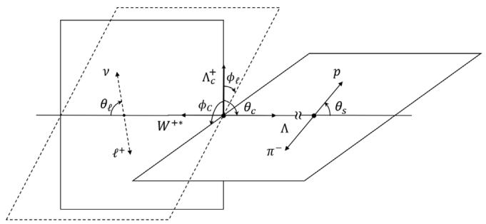  
FIG. 1. Definitions of angles, where the spin of  $\Lambda_c^+$  points toward the direction of  $\theta_c = 0$ .

$$
\langle \mathcal {X} _ {i} (\ell) \rangle = \frac {1}{\Gamma^ {\ell}} \int_ {M _ {\ell} ^ {2}} ^ {M _ {-} ^ {2}} \zeta \mathcal {X} _ {i} d q ^ {2}. \tag {30}
$$

The form factors calculated in the LQCD can be found in Refs. [25,26], where  $\mathcal{B}$  are also provided. In this work, we calculate the angular observables from both the HBM and LQCD, listed in Table II. The central values and uncertainties of the LQCD come from the nominal and higher order fits, respectively [25,26]. Large parts of the uncertainties are canceled due to the correlations between  $\mathcal{X}_i$  and  $\Gamma$ . It is worth mentioning that the HBM results agree well with the LQCD ones, except for  $\langle \mathcal{X}_{14,18,20}(\ell)\rangle$ , attributed to  $a_{+}a_{-}^{*}$ .

The reason for the deviations can be traced back to the form factors in the HBM, plotted in Fig. 2 and Table III. By taking reasonable approximations of  $f_{1} = g_{1}$  and  $g_{2} = 0$ , we have  $a_{+} \propto f_{2}$  from Eq. (25). Our approach based on the BM underestimates  $f_{2}$  by a factor of two-thirds, leading to a smaller  $a_{+}$ . This factor affects little the branching fractions, but plays important roles in some of the decay observables. We believe that it is somewhat a universal factor in the BM. For instance, the magnetic dipole

TABLE II. Definitions of  ${\mathcal{X}}_{i}$  and their average values in units of percentage.  

<table><tr><td rowspan="2">i</td><td rowspan="2">X_i(Λ_c^+ → Λℓ^+ν)</td><td colspan="2">HBM</td><td colspan="2">LQCD</td></tr><tr><td>{X_i(e)}</td><td>{X_i(μ)}</td><td>{X_i(e)}</td><td>{X_i(μ)}</td></tr><tr><td>2</td><td>(2δ_ℓ-1)(|a|^2 - 1/2 |b|^2)</td><td>-43.1(9)</td><td>-37.1(7)</td><td>-43.8(13)</td><td>-37.6(11)</td></tr><tr><td>3</td><td>-6δ_ℓ(Re(a_+t_+^*) + Re(a_-t_-^*)) + 3/2 |b_Δ|^2</td><td>35.2(10)</td><td>28.6(12)</td><td>40.2(12)</td><td>33.7(13)</td></tr><tr><td>4</td><td>(δ_ℓ+1)(|a_Δ|^2 + |b_Δ|^2) + 3δ_ℓ|t_Δ|^2</td><td>-35.7(13)</td><td>-35.4(13)</td><td>-33.7(15)</td><td>-33.3(15)</td></tr><tr><td>5</td><td>(2δ_ℓ-1)(|a_Δ|^2 - 1/2 |b_Δ|^2)</td><td>70.8(3)</td><td>64.0(1)</td><td>73.9(9)</td><td>67.0(8)</td></tr><tr><td>6</td><td>-6δ_ℓ[Re(a_+t_+^*) - Re(a_-t_-^*)] - 3/2 |b_Δ|^2</td><td>-35.2(10)</td><td>-28.5(12)</td><td>-40.2(12)</td><td>-33.7(13)</td></tr><tr><td>7</td><td>3/√2 [2δ_ℓ(t_-b_+^* - b_-t_+^*) + (a_-b_+^* + b_-a_+^*)]</td><td>-91.1(7)</td><td>-91.3(6)</td><td>-91.5(8)</td><td>-91.7(7)</td></tr><tr><td>8</td><td>3/√2 (2δ_ℓ-1)(b_-a_+^* - a_-b_+^*)</td><td>-78.0(5)</td><td>-73.9(6)</td><td>-83.1(10)</td><td>-79.0(9)</td></tr><tr><td>9</td><td>(δ_ℓ+1)(|a_Δ|^2 - |b_Δ|^2) + 3δ_ℓ|t_Δ|^2 X_9</td><td>-82.6(0)</td><td>-82.3(0)</td><td>-87.4(10)</td><td>-87.2(10)</td></tr><tr><td>10</td><td>(2δ_ℓ-1)(|a_Δ|^2 + 1/2 |b_Δ|^2)</td><td>47.4(10)</td><td>41.3(8)</td><td>47.1(12)</td><td>40.9(11)</td></tr><tr><td>11</td><td>6δ_ℓ(Re(a_-t_-^*) - Re(a_+t_+^*)) - 3/2 |b|^2</td><td>-56.9(9)</td><td>-50.2(11)</td><td>-56.2(13)</td><td>-49.8(14)</td></tr><tr><td>12</td><td>3/√2 [2δ_ℓ(b_-t_-^* - t_+b_+^*) - (a_+b_+^* + b_-a_+^*)]</td><td>-49.0(1)</td><td>-47.5(0)</td><td>-38.8(25)</td><td>-38.0(24)</td></tr><tr><td>13</td><td>3/√2 [2δ_ℓ(a_+b_+^* - b_-a_+^*) + (b_-a_+^* - a_+b_+^*)]</td><td>25.1(6)</td><td>23.8(5)</td><td>22.9(15)</td><td>21.8(14)</td></tr><tr><td>14</td><td>(2δ_ℓ+1)a_+a_+^*</td><td>-5.8(1)</td><td>-6.0(1)</td><td>-3.0(9)</td><td>-3.3(9)</td></tr><tr><td>15</td><td>2δ_ℓ(|a|^2 + |b|^2) - (|a|^2 + 1/2 |b|^2)</td><td>-81.0(3)</td><td>-73.8(1)</td><td>-81.3(4)</td><td>-74.0(3)</td></tr><tr><td>16</td><td>δ_ℓ(|a|^2 - |b|^2 + 3|t|^2) + (|a|^2 - |b|^2)</td><td>24.2(12)</td><td>24.0(12)</td><td>25.0(17)</td><td>24.5(17)</td></tr><tr><td>17</td><td>-6δ_ℓ(Re(a_+t_+^*) + Re(a_-t_-^*) - 3/2 |b_Δ|^2</td><td>-35.2(10)</td><td>-41.0(8)</td><td>-40.3(12)</td><td>-46.3(12)</td></tr><tr><td>18</td><td>(2-4δ_ℓ)a_+a_+^*</td><td>-11.6(1)</td><td>-11.7(1)</td><td>-6.1(19)</td><td>-6.7(16)</td></tr><tr><td>19</td><td>(1-2δ_ℓ)b_+b_+^*</td><td>-14.5(1)</td><td>-14.2(1)</td><td>-12.5(6)</td><td>-12.3(6)</td></tr><tr><td>20</td><td>-2δ_ℓ(a_+a_+^* + 3t_+t_-^*) - 2a_+a_+^*</td><td>11.6(1)</td><td>11.6(1)</td><td>6.1(19)</td><td>6.4(17)</td></tr><tr><td>21</td><td>(2δ_ℓ-1)b_+b_+^*</td><td>14.5(1)</td><td>14.2(1)</td><td>12.5(6)</td><td>12.3(6)</td></tr><tr><td>22</td><td>6δ_ℓ(a_+t_+^* + t_+a_+^*)</td><td>0.0(0)</td><td>0.4(0)</td><td>0.0(0)</td><td>0.5(2)</td></tr><tr><td>23</td><td>3/√2 [(b_-a_+^* - a_-b_+^*) - 2δ_ℓ(b_-t_+^* + t_-b_+^*)]</td><td>78.0(5)</td><td>77.8(5)</td><td>83.1(10)</td><td>83.1(10)</td></tr><tr><td>24</td><td>3/√2 [(b_-a_+^* - a_+b_+^*) - 2δ_ℓ(b_-t_+^* + t_+b_+^*)]</td><td>25.1(6)</td><td>23.9(5)</td><td>22.9(15)</td><td>22.0(15)</td></tr><tr><td>25</td><td>3/√2 [2δ_ℓ(a_+b_+^* + b_-a_+^*) - (a_+b_+^* + b_-a_+^*)]</td><td>-49.0(1)</td><td>-47.7(0)</td><td>-38.8(25)</td><td>-38.1(24)</td></tr><tr><td>26</td><td>3/√2 [2δ_ℓ(b_+a_+^* - a_+b_+^*) - (a_+b_+^* + b_-a_+^*)]</td><td>-49.0(1)</td><td>-48.0(0)</td><td>-38.8(25)</td><td>-38.2(24)</td></tr></table>

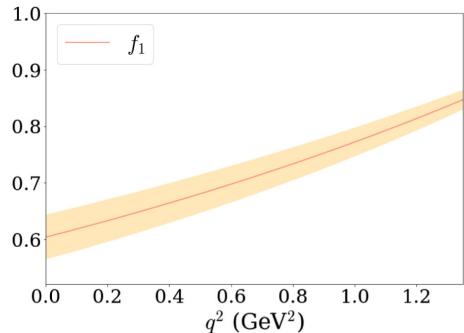

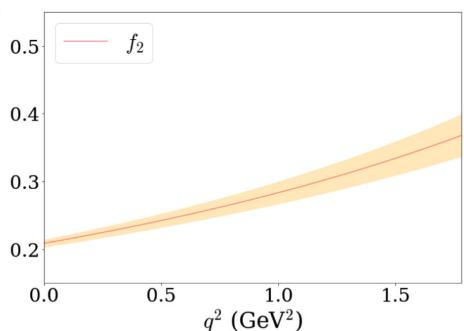

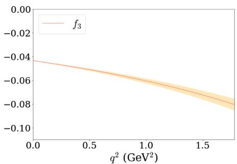

  
FIG. 2. The  $q^2$  dependencies of the form factors in  $\Lambda_c^+ \to \Lambda$  from the HBM, where the bands represent the uncertainties from the model calculations.

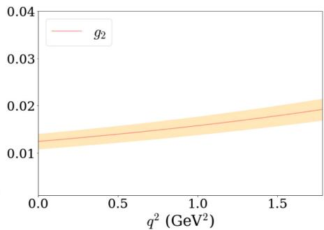

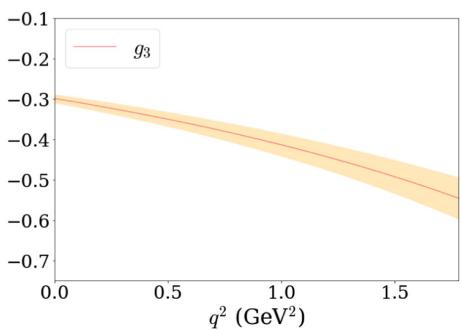

TABLE III. The form factors of  $\Lambda_c^+ \to \Lambda$  at  $q^2 = 0$ .  

<table><tr><td></td><td>f1(0)</td><td>f2(0)</td><td>g1(0)</td><td>g2(0)</td></tr><tr><td>HBM</td><td>0.604(39)</td><td>0.209(5)</td><td>0.566(34)</td><td>0.012(2)</td></tr><tr><td>LQCD [25]</td><td>0.643(23)</td><td>0.308(36)</td><td>0.572(15)</td><td>0.001(45)</td></tr></table>

moments of the octet baryons, proportional to  $f_{2}$ , are also systematically underestimated by a factor of two-thirds in the MIT BM [36]. In both LQCD and HBM, the leading order relation in the  $1 / m_{c}$  expansion of  $f_{1} = g_{1}$  holds considerably well, but  $f_{2} = g_{2}$  is badly broken in contrast [38]. In particular, we find that  $f_{2}$  is about 15 times larger than  $g_{2}$ , indicating the subleading corrections are important and shall not be omitted [39].

To compare our results with the experiments, we calculate the form factors  $f \in \{g_{\perp}, g_{+}, f_{\perp}, f_{+}\}$  adopted by the experiments. The definitions of  $f$  can be found explicitly in Ref. [26], while their  $q^{2}$  dependencies are governed by

$$
f \left(q ^ {2}\right) = \frac {a _ {0} ^ {f}}{1 - q ^ {2} / \left(m _ {\text {p o l e}} ^ {f}\right) ^ {2}} \left[ 1 + \alpha_ {1} ^ {f} \times z \left(q ^ {2}\right) \right], \tag {31}
$$

where  $m_{\mathrm{pole}}^{f}$  is the pole mass,  $z = (\sqrt{t_{+} - q^{2}} - \sqrt{t_{+} - t_{0}})/(\sqrt{t_{+} - q^{2}} + \sqrt{t_{+} - t_{0}})$  with  $t_{0} = (M_{c} - M_{s})^{2}$ , and  $t_{+} = (M_{D} + M_{K})^{2}$ . The adopted masses are  $(M_{D}, M_{K}, m_{\mathrm{pole}}^{f_{\perp}, f_{+}}$ ,  $m_{\mathrm{pole}}^{g_{\perp}, g_{+}}) = (1.87, 0.494, 2.112, 2.46)$  GeV.

The results of HBM, LQCD, and BESIII are given in Table IV with  $r_f = a_0^f /a_0^{g_\perp}$ , while the form factors from HBM and BESIII are drawn explicitly in Fig. 3. The HBM results of  $a_0^{g_\perp},\alpha_1^{g_\perp},\alpha_1^{g_+}$  lie between the ones of LQCD and BESIII, whereas the signs of  $\alpha_{1}^{f_{\perp},f_{+}}$  are barely determined in the HBM. Notice that  $r_{g_{+}} = 1$  holds automatically from the definition of the form factors, which is also found explicitly in the experiments. Figure 3 shows that the main deviations between the results of HBM and BESIII occur in  $f_{\perp}$  at the high  $q^2$  region.

Some of the decay observables  $\mathcal{X}_i$  have already been studied in the literature, bearing different names. The polarization asymmetries are defined as

$$
\alpha_ {\Lambda} = \frac {\Gamma^ {\ell} (\lambda_ {q} = 1 / 2) - \Gamma^ {\ell} (\lambda_ {q} = - 1 / 2)}{\Gamma^ {\ell} (\lambda_ {q} = 1 / 2) + \Gamma^ {\ell} (\lambda_ {q} = - 1 / 2)}, \tag {32}
$$

which are extracted by the cascade decays of  $\Lambda$  in the experiments, given as

$$
\alpha_ {\Lambda} = \frac {2}{\alpha \Gamma^ {\ell}} \left(\int_ {0} ^ {1} - \int_ {- 1} ^ {0}\right) \Gamma_ {\cos \theta_ {s}} ^ {\ell} d \cos \theta_ {s} = \langle \mathcal {X} _ {9} (\ell) \rangle . \tag {33}
$$

Likewise, the forward-backward asymmetries are

$$
\alpha_ {\ell} = \frac {1}{\Gamma^ {\ell}} \left(\int_ {0} ^ {1} - \int_ {- 1} ^ {0}\right) \Gamma_ {\cos \theta_ {\ell}} ^ {\ell} d \cos \theta_ {\ell} = \frac {1}{2} \langle \mathcal {X} _ {3} (\ell) \rangle , \tag {34}
$$

describing the distributions in  $W^{+*}\to \ell^{+}\nu$ , while the up-. down asymmetries are

$$
\alpha_ {c} = \frac {2}{P _ {b} \Gamma^ {\ell}} \left(\int_ {0} ^ {1} - \int_ {- 1} ^ {0}\right) \Gamma_ {\cos \theta_ {c}} ^ {\ell} d \cos \theta_ {c} = \langle \mathcal {X} _ {4} (\ell) \rangle . \tag {35}
$$

Note that we have adopted the shorthand notations of  $\Gamma_{\Omega}^{\ell} = \partial \Gamma^{\ell} / (\Gamma^{\ell}\partial \vec{\Omega})$

We compare  $\alpha_{\Lambda}$  with those in the literature in Table V. In all the quark models,  $\alpha_{\Lambda}$  depend little on the lepton flavors. Except for those in Ref. [30],  $\alpha_{\Lambda}$  are consistent with the experimental values. In contrast to other approaches, the predicted values of  $\alpha_{\Lambda}$  in the HBM have little uncertainty due to the correlations. However, they are smaller than those in the LQCD. The future experiments on  $\alpha_{\Lambda}$  shall be able to clarify the issue.

# B. Observables in  $\Lambda_c^+ \to n\ell^+ \nu_\ell$

As the cascade decays of the neutron cannot be observed in the experiments, there are only eight possible decay observables in  $\Lambda_c^+ \to ne^+\nu$ , in which five of them require  $P_b \neq 0$  for the measurements, given as

$$
\begin{array}{l} \mathcal {D} \left(q ^ {2}, \vec {\Omega}\right) \propto 1 + \mathcal {X} _ {2} P _ {2} + \mathcal {X} _ {3} \cos \theta_ {\ell} + P _ {b} \left(\mathcal {X} _ {4} \cos \theta_ {c} \right. \\ + \mathcal {X} _ {5} \cos \theta_ {c} P _ {2} + \mathcal {X} _ {6} \cos \theta_ {c} \cos \theta_ {\ell} \\ + \operatorname {R e} \left(\mathcal {X} _ {7} e ^ {i \phi_ {\ell}}\right) \sin \theta_ {c} \sin \theta_ {\ell} \\ + \operatorname {R e} \left(\mathcal {X} _ {8} e ^ {i \phi_ {\ell}}\right) \sin \theta_ {c} \sin \theta_ {\ell} \cos \theta_ {\ell}). \tag {36} \\ \end{array}
$$

The discussions are parallel to  $\Lambda_c^+ \to \Lambda \ell^+ \nu_\ell$ . We list the branching fractions and decay observables in Tables VI and VII, respectively. The branching fractions in the HBM are compatible with those in the LQCD [26] and Ref. [30], but twice as large as the results in Ref. [29]. On the other

TABLE IV. Form factors compared with LQCD and experiments.  

<table><tr><td></td><td>a0g↓</td><td>α1g↓</td><td>α1g+</td><td>α1f↓</td><td>α1f+</td><td>rf+</td><td>rf↓</td><td>rg+</td></tr><tr><td>LQCD</td><td>0.68(2)</td><td>-2.82(49)</td><td>-3.61(31)</td><td>-2.52(84)</td><td>-3.58(55)</td><td>1.19(3)</td><td>1.92(7)</td><td>1</td></tr><tr><td>HBM</td><td>0.63(1)</td><td>-0.91(60)</td><td>-1.05(58)</td><td>0.16(66)</td><td>-0.29(72)</td><td>1.03(1)</td><td>1.51(5)</td><td>1</td></tr><tr><td>Exp</td><td>0.54(4)</td><td colspan="2">1.43(209)</td><td colspan="2">-8.15(158)</td><td>1.75(32)</td><td>3.62(65)</td><td>1.13(13)</td></tr></table>

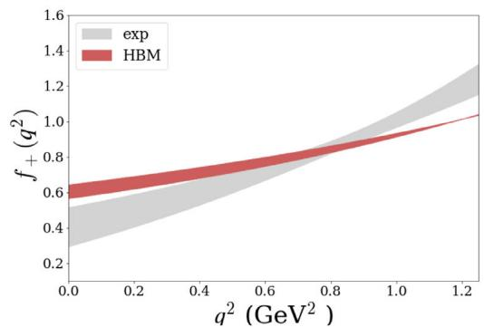

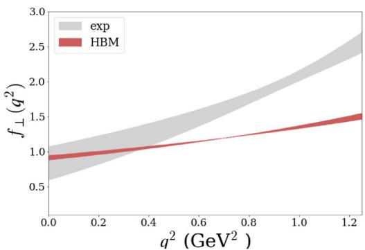

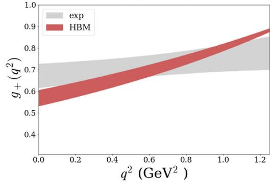  
FIG. 3. The form factors obtained from HBM and the BESIII measurements.

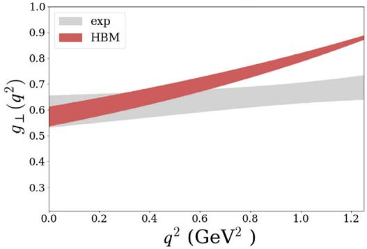

hand, the  $SU(3)_F$  symmetry predicts relatively large branching fractions compared to the others.

The calculated values of  $\langle \mathcal{X}_i(\ell) \rangle$  show consistencies between the HBM and LQCD. Nevertheless,  $\mathcal{X}_{4-8}$  require  $\Lambda_c^+$  to be polarized for measurements, imposing difficulties in the experiments. The form factors of  $\Lambda_c^+ \to n$  are given in Table VIII and Fig. 4. We see that, once again, the HBM

TABLE V. Results of  ${\alpha }_{\Lambda }\left( {{\Lambda }_{c}^{ + } \rightarrow  {\Lambda }^{{\ell }^{ + }}{\nu }_{\ell }}\right)$  in units of percentage.  

<table><tr><td></td><td>αΛ(Λc+ → Λe+νe)</td><td>αΛ(Λc+ → Λμ+νμ)</td></tr><tr><td>HBM</td><td>-82.6(0)</td><td>-82.3(0)</td></tr><tr><td>LQCD [25]</td><td>-87.4(10)</td><td>-87.2(10)</td></tr><tr><td>Data [1]</td><td>-86(4)</td><td>...</td></tr><tr><td>RQM [24]</td><td>-86</td><td>...</td></tr><tr><td>LFQM [30]</td><td>-97(3)</td><td>-98(2)</td></tr><tr><td>LFQM [31]</td><td>-87(9)</td><td>-87(9)</td></tr><tr><td>SU(3) [32]</td><td>-86(4)</td><td>...</td></tr></table>

TABLE VI. The branching fractions of  $\Lambda_c^+ \to n\ell^+ \nu_\ell$  in units of percentage.  

<table><tr><td></td><td>B(Λc+ → ne+νe)</td><td>B(Λc+ → nμ+νμ)</td></tr><tr><td>HBM</td><td>0.40(4)</td><td>0.40(4)</td></tr><tr><td>RQM [24]</td><td>0.268</td><td>0.262</td></tr><tr><td>LQCD [26]</td><td>0.410(29)</td><td>0.400(29)</td></tr><tr><td>LFQM [29]</td><td>0.201</td><td>...</td></tr><tr><td>LFQM [30]</td><td>0.36(15)</td><td>0.34(15)</td></tr><tr><td>SU(3)_F [33]</td><td>0.520(46)</td><td>0.506(45)</td></tr></table>

underestimates  $f_{2}$  by a factor of two-thirds, whereas the others are compatible with the LQCD.

# IV. TIME-REVERSAL ASYMMETRIES AND NEW PHYSICS

In general, contaminated by the hadron uncertainties, it is often difficult to draw a sharp conclusion on whether NP is needed to explain the experimental data. Nevertheless, NP can generate clear signals of T asymmetries, which vanish in the SM and are equivalent to the  $CP$  asymmetries based on the  $CPT$  theorem. A great advantage of T violation is that a strong phase is not necessary. The simplest T violating observables are studied in Ref. [35], and we highlight some the results here.

Two of the simplest T asymmetries in  $\Lambda_c^+ \to \Lambda (\to p\pi^-) \ell^+ \nu_\ell$  are defined as

$$
\begin{array}{l} \mathcal {T} _ {\ell} = \frac {1}{P _ {b}} \left(\int_ {0} ^ {\pi} - \int_ {\pi} ^ {2 \pi}\right) \Gamma_ {\phi_ {\ell}} ^ {\ell} d \phi_ {\ell} \\ = - \frac {\pi^ {2}}{8 \Gamma^ {\ell}} \int_ {M _ {\varepsilon} ^ {2}} ^ {M _ {-} ^ {2}} \zeta \operatorname {I m} \left(\mathcal {X} _ {7}\right) d q ^ {2}, \\ \end{array}
$$

$$
\begin{array}{l} \mathcal {T} _ {s} = \frac {1}{\alpha} \left[ \left(\int_ {0} ^ {\pi} - \int_ {\pi} ^ {2 \pi}\right) d \Phi \right] \left[ \left(\int_ {0} ^ {1} - \int_ {- 1} ^ {0}\right) d \cos \theta_ {s} \right] \Gamma_ {\phi_ {\ell}, \cos \theta_ {s}} ^ {\ell} \\ = - \frac {2}{3 \pi \Gamma^ {\ell}} \int_ {M _ {\ell} ^ {2}} ^ {M _ {-} ^ {2}} \zeta \operatorname {I m} \left(\mathcal {X} _ {1 2}\right) d q ^ {2}, \tag {37} \\ \end{array}
$$

which are closely related to the azimuthal angles. The reason is that they correspond to the triple product asymmetries of

TABLE VII. The integrated observables in units of percentage.  

<table><tr><td rowspan="2">i</td><td rowspan="2">X_i(Λ_c^+ → nℓ^+ν)</td><td colspan="2">HBM</td><td colspan="2">LQCD</td></tr><tr><td>{X_i(e)}</td><td>{X_i(μ)}</td><td>{X_i(e)}</td><td>{X_i(μ)}</td></tr><tr><td>2</td><td>(2δ_ℓ-1)(|a|^2 - 1/2 |b|^2)</td><td>-42.3(13)</td><td>-36.5(10)</td><td>-43.4(16)</td><td>-37.2(15)</td></tr><tr><td>3</td><td>-6δ_ℓ(Re(a_+t_+^*) + Re(a_-t_-^*)) + 3/2 |b_Δ|^2</td><td>36.4(14)</td><td>30.0(17)</td><td>41.1(18)</td><td>34.4(18)</td></tr><tr><td>4</td><td>(δ_ℓ+1)(|a_Δ|^2 + |b_Δ|^2) + 3δ_ℓ|t_Δ|^2</td><td>-34.3(19)</td><td>-34.1(18)</td><td>-32.8(21)</td><td>-32.5(21)</td></tr><tr><td>5</td><td>(2δ_ℓ-1)(|a_Δ|^2 - 1/2 |b_Δ|^2)</td><td>70.7(4)</td><td>64.0(2)</td><td>73.9(13)</td><td>66.9(12)</td></tr><tr><td>6</td><td>-6δ_ℓ[Re(a_+t_+^*) - Re(a_-t_-^*)] - 3/2 |b_Δ|^2</td><td>-36.4(14)</td><td>-29.8(17)</td><td>-41.1(18)</td><td>-34.4(18)</td></tr><tr><td>7</td><td>3/√2[2δ_ℓ(t_-b_+^* - b_-t_+^*) + (a_-b_+^* + b_-a_+^*)]</td><td>-91.7(9)</td><td>-91.9(9)</td><td>-92.1(7)</td><td>-92.3(7)</td></tr><tr><td>8</td><td>3/√2(2δ_ℓ-1)(b_-a_+^* - a_-b_+^*)</td><td>-78.7(7)</td><td>-74.7(8)</td><td>-83.2(15)</td><td>-79.0(14)</td></tr></table>

TABLE VIII. The form factors of  ${\Lambda }_{c}^{ + } \rightarrow  n$  at  ${q}^{2} = 0$  .  

<table><tr><td></td><td>f1(0)</td><td>f2(0)</td><td>g1(0)</td><td>g2(0)</td></tr><tr><td>HBM</td><td>0.570(56)</td><td>0.210(1)</td><td>0.526(50)</td><td>0.015(2)</td></tr><tr><td>LQCD [26]</td><td>0.672(39)</td><td>0.321(38)</td><td>0.602(31)</td><td>-0.003(52)</td></tr></table>

the three-momenta in the final states. Keeping in mind  $\xi_{\pm}$  are real in the SM, it is easy to see that nonvanishing  $\mathcal{T}_{\ell ,s}$  require NP beyond the SM.

As an illustration, we explore NP with the effective Hamiltonian as

$$
\begin{array}{l} \mathcal {H} _ {\mathrm {e f f}} ^ {\mathrm {N P}} \\ = \frac {G _ {F}}{\sqrt {2}} V _ {c s} \left[ C _ {L} \bar {s} \gamma_ {\mu} (1 - \gamma_ {5}) c + C _ {R} \bar {s} \gamma_ {\mu} (1 + \gamma_ {5}) c \right] \bar {v} \gamma_ {\mu} (1 - \gamma_ {5}) u. \tag {38} \\ \end{array}
$$

To first order, we find that [35]

$$
\mathcal {T} _ {\ell} = - \frac {3 \pi^ {2}}{8 \sqrt {2}} \operatorname {I m} \left(C _ {R}\right) \mathcal {Y} _ {\ell}, \quad \mathcal {T} _ {s} = - \frac {\sqrt {2}}{\pi} \operatorname {I m} \left(C _ {R}\right) \mathcal {Y} _ {s}, \tag {39}
$$

with

$$
\begin{array}{l} \mathcal {Y} _ {\ell} = \frac {1}{\Gamma^ {\ell}} \int_ {M _ {\ell} ^ {2}} ^ {M _ {-} ^ {2}} 2 \zeta (a _ {+} b _ {+} - a _ {-} b _ {-}) d q ^ {2}, \\ \mathcal {Y} _ {s} = \frac {1}{\Gamma^ {\ell}} \int_ {M _ {\ell} ^ {2}} ^ {M _ {-} ^ {2}} 2 \zeta \left(a _ {+} b _ {-} - a _ {-} b _ {+}\right) d q ^ {2}, \tag {40} \\ \end{array}
$$

where  $C_{L,R}$  are the Wilson coefficients from NP, and  $\xi_{\pm}$  in Eq. (40) are calculated within the SM. In practice,  $C_L$  can be absorbed by redefining  $V_{cs}$ , so their effects vanish in the first order. We only considered NP with the left-handed

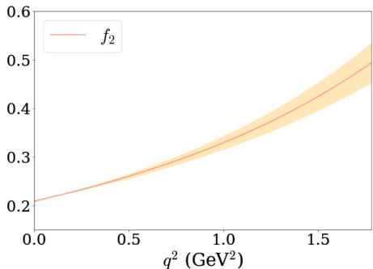

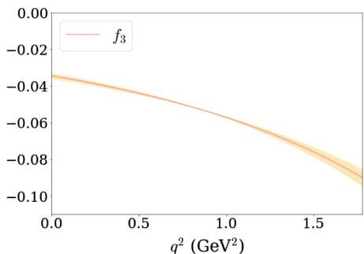

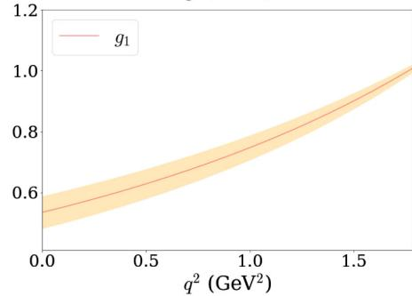  
FIG. 4. The  $q^2$  dependencies of the form factors in  $\Lambda_c^+ \to n$  from HBM, where the bands represent the uncertainties from the model calculations.

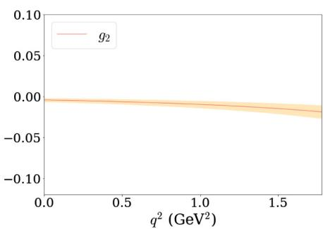

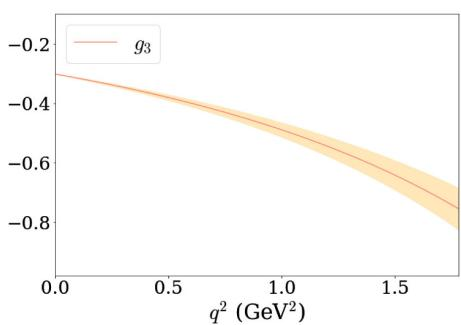

TABLE IX. The time-reversal asymmetries versus  $\operatorname{Im}(C_R)$  from NP.  

<table><tr><td></td><td colspan="2">Im(CR) = 0.1</td><td colspan="2">Im(CR) = 0.2</td></tr><tr><td></td><td>ℓ+ = e+</td><td>ℓ+ = μ+</td><td>ℓ+ = e+</td><td>ℓ+ = μ+</td></tr><tr><td>Tl</td><td>0.062(2)</td><td>0.060(2)</td><td>0.124(4)</td><td>0.120(4)</td></tr><tr><td>Ts</td><td>0.033(3)</td><td>0.032(3)</td><td>0.066(1)</td><td>0.064(1)</td></tr></table>

neutrinos and leptons, as the right-handed ones are suppressed by the lepton masses [35].

The values of  $\mathcal{Y}_{\ell,s}$  can be viewed as the sensitivity coefficients of NP. We take  $\mathrm{Im}(C_R) = (0.1, 0.2)$  as examples in Table IX. We see that  $T_{\ell}$  can be as large as  $10\%$ , but they require  $\Lambda_c^+$  to be polarized for an experimental measurement. On the other hand, though  $T_c$  can be probed with unpolarized  $\Lambda_c^+$ , their values are twice as small as  $T_{\ell}$ , making them hard to be observed. Finally, we emphasize that the T asymmetry does not require a comparison with the charge conjugate as the strong phase is irrelevant.

# V. SUMMARY

We have given a systematical study of all the possible observables in  $\Lambda_c^+$  semileptonic decays, including the effects of NP. The model-independent angular distributions with polarized  $\Lambda_c^+$  have been presented. We have found that the BM underestimates  $f_{2}$  by a factor of two-thirds, where

the same underestimations were also found in the magnetic dipole moments of the octet baryons. The branching fractions and polarization asymmetries have been found to be  $\mathcal{B}(\Lambda_c^+ \to \Lambda e^+ \nu_e, \Lambda \mu^+ \nu_\mu, n\ell^+ \nu_\ell) = (3.78 \pm 0.25, 3.67 \pm 0.23, 0.40 \pm 0.04)\%$  and  $\alpha_{\Lambda}(\Lambda_c^+ \to \Lambda e^+ \nu_e, \Lambda \mu^+ \nu_\mu) = (-82.6, -82.3)\%$  from the HBM, and  $\alpha_{\Lambda}(\Lambda_c^+ \to \Lambda e^+ \nu_e, \Lambda \mu^+ \nu_\mu) = (-87.4 \pm 1.0, -87.2 \pm 1.0)\%$  from the LQCD, which can be tested in the near future at BESIII and Belle II. In particular,  $\mathcal{B}(\Lambda_c^+ \to \Lambda e^+ \nu_e, \Lambda \mu^+ \nu_\mu)$  and  $\alpha_{\Lambda}(\Lambda_c^+ \to \Lambda e^+ \nu_e)$  are in good agreement with the current experimental data [1,3]. All the angular observables in the SM have been computed by both the HBM and LQCD. Most of the results from the two approaches have been shown to be consistent. The effects of NP on the T asymmetries have been explored and found to be  $\mathcal{O}(10\%)$  for  $\mathrm{Im}(C_R) = 0.2$ . We stress that nonzero values of T asymmetries in the experiments will be a smoking gun of NP.

# ACKNOWLEDGMENTS

The authors are indebted to Stefan Meinel for the help on the LQCD form factors. This work is supported in part by the National Key Research and Development Program of China under Grant No. 2020YFC2201501 and the National Natural Science Foundation of China (NSFC) under Grant No. 12147103.

# APPENDIX: BARYON WAVE FUNCTIONS

For completeness, we display the wave functions of the low-lying baryons in the HBM. The wave functions of the octet baryons associated with the isospin of  $I = 1 / 2$  are given as

$$
| n, \updownarrow \rangle = \int \frac {1}{2 \sqrt {3}} \epsilon^ {\alpha \beta \gamma} d _ {a \alpha} ^ {\dagger} (\vec {x} _ {1}) u _ {b \beta} ^ {\dagger} (\vec {x} _ {2}) d _ {c \gamma} ^ {\dagger} (\vec {x} _ {3}) \Psi_ {A _ {\updownarrow} (d u s)} ^ {a b c} (\vec {x} _ {1}, \vec {x} _ {2}, \vec {x} _ {3}) [ d ^ {3} \vec {x} ] | 0 \rangle ,
$$

$$
| p, \updownarrow \rangle = \int \frac {1}{2 \sqrt {3}} \epsilon^ {\alpha \beta \gamma} d _ {a \alpha} ^ {\dagger} (\vec {x} _ {1}) u _ {b \beta} ^ {\dagger} (\vec {x} _ {2}) u _ {c \gamma} ^ {\dagger} (\vec {x} _ {3}) \Psi_ {A _ {\updownarrow} (d u s)} ^ {a b c} (\vec {x} _ {1}, \vec {x} _ {2}, \vec {x} _ {3}) [ d ^ {3} \vec {x} ] | 0 \rangle ,
$$

$$
| \Lambda , \updownarrow \rangle = \int \frac {1}{\sqrt {6}} \epsilon^ {\alpha \beta \gamma} d _ {a \alpha} ^ {\dagger} (\vec {x} _ {1}) u _ {b \beta} ^ {\dagger} (\vec {x} _ {2}) s _ {c \gamma} ^ {\dagger} (\vec {x} _ {3}) \Psi_ {A _ {\updownarrow} (d u s)} ^ {a b c} (\vec {x} _ {1}, \vec {x} _ {2}, \vec {x} _ {3}) [ d ^ {3} \vec {x} ] | 0 \rangle ,
$$

$$
\left| \Xi^ {-}, \updownarrow \right\rangle = \int \frac {1}{2 \sqrt {3}} \epsilon^ {\alpha \beta \gamma} d _ {a \alpha} ^ {\dagger} (\vec {x} _ {1}) s _ {b \beta} ^ {\dagger} (\vec {x} _ {2}) s _ {c \gamma} ^ {\dagger} (\vec {x} _ {3}) \Psi_ {A _ {\updownarrow} (d u s)} ^ {a b c} (\vec {x} _ {1}, \vec {x} _ {2}, \vec {x} _ {3}) [ d ^ {3} \vec {x} ] | 0 \rangle ,
$$

$$
\left| \Xi^ {0}, \updownarrow \right\rangle = \int \frac {1}{2 \sqrt {3}} \epsilon^ {\alpha \beta \gamma} u _ {a \alpha} ^ {\dagger} (\vec {x} _ {1}) s _ {b \beta} ^ {\dagger} (\vec {x} _ {2}) s _ {c \gamma} ^ {\dagger} (\vec {x} _ {3}) \Psi_ {A _ {\updownarrow} (d u s)} ^ {a b c} (\vec {x} _ {1}, \vec {x} _ {2}, \vec {x} _ {3}) [ d ^ {3} \vec {x} ] | 0 \rangle , \tag {A1}
$$

and the ones with  $I = 1$  read as

$$
| \Sigma^ {+}, \updownarrow \rangle = \int \frac {1}{2 \sqrt {3}} \epsilon^ {\alpha \beta \gamma} u _ {a \alpha} ^ {\dagger} (\vec {x} _ {1}) u _ {b \beta} ^ {\dagger} (\vec {x} _ {2}) s _ {c \gamma} ^ {\dagger} (\vec {x} _ {3}) \Psi_ {S _ {\dagger} (u u c)} ^ {a b c} (\vec {x} _ {1}, \vec {x} _ {2}, \vec {x} _ {3}) [ d ^ {3} \vec {x} ] | 0 \rangle ,
$$

$$
| \Sigma^ {0}, \updownarrow \rangle = \int \frac {1}{\sqrt {6}} \epsilon^ {\alpha \beta \gamma} d _ {a \alpha} ^ {\dagger} (\vec {x} _ {1}) u _ {b \beta} ^ {\dagger} (\vec {x} _ {2}) s _ {c \gamma} ^ {\dagger} (\vec {x} _ {3}) \Psi_ {S _ {\updownarrow} (u u c)} ^ {a b c} (\vec {x} _ {1}, \vec {x} _ {2}, \vec {x} _ {3}) [ d ^ {3} \vec {x} ] | 0 \rangle ,
$$

$$
\left| \Sigma^ {-}, \updownarrow \right\rangle = \int \frac {1}{2 \sqrt {3}} \epsilon^ {\alpha \beta \gamma} d _ {a \alpha} ^ {\dagger} (\vec {x} _ {1}) d _ {b \beta} ^ {\dagger} (\vec {x} _ {2}) s _ {c \gamma} ^ {\dagger} (\vec {x} _ {3}) \Psi_ {S _ {\updownarrow} (u u c)} ^ {a b c} (\vec {x} _ {1}, \vec {x} _ {2}, \vec {x} _ {3}) [ d ^ {3} \vec {x} ] | 0 \rangle . \tag {A2}
$$

The spin-flavor-antisymmetric spatial distribution  $\Psi_{A}$  is defined in Eq. (16), and the symmetric one is given as

$$
\begin{array}{l} \Psi_ {S _ {\uparrow} (q _ {1} q _ {2} q _ {3})} ^ {a b c} (\vec {x} _ {1}, \vec {x} _ {2}, \vec {x} _ {3}) = \frac {\mathcal {N} _ {\mathcal {B}}}{\sqrt {6}} \int (2 \phi_ {q _ {1} \uparrow} ^ {a} (\vec {x} _ {1} ^ {\prime}) \phi_ {q _ {2} \uparrow} ^ {b} (\vec {x} _ {2} ^ {\prime \prime}) \phi_ {q _ {3} \downarrow} ^ {c} (\vec {x} _ {3} ^ {\prime \prime}) \\ - \phi_ {q _ {1} \uparrow} ^ {a} (\vec {x} _ {1} ^ {\prime}) \phi_ {q _ {2} \downarrow} ^ {b} (\vec {x} _ {2} ^ {\prime}) \phi_ {q _ {3} \uparrow} ^ {c} (\vec {x} _ {3} ^ {\prime}) - \phi_ {q _ {1} \downarrow} ^ {a} (\vec {x} _ {1} ^ {\prime}) \phi_ {q _ {2} \uparrow} ^ {b} (\vec {x} _ {2} ^ {\prime}) \phi_ {q _ {3} \uparrow} ^ {c} (\vec {x} _ {3} ^ {\prime})) d ^ {3} \vec {x} _ {\Delta}, \\ \end{array}
$$

$$
\begin{array}{l} \Psi_ {S _ {\downarrow} \left(q _ {1} q _ {2} q _ {3}\right)} ^ {a b c} (\vec {x} _ {1}, \vec {x} _ {2}, \vec {x} _ {3}) = \frac {\mathcal {N} _ {\mathcal {B}}}{\sqrt {6}} \int (- 2 \phi_ {q _ {1} \downarrow} ^ {a} (\vec {x} _ {1} ^ {\prime}) \phi_ {q _ {2} \downarrow} ^ {b} (\vec {x} _ {2} ^ {\prime}) \phi_ {q _ {3} \uparrow} ^ {c} (\vec {x} _ {3} ^ {\prime}) \\ + \phi_ {q _ {1} \downarrow} ^ {a} \left(\overrightarrow {x _ {1}} ^ {\prime}\right) \phi_ {q _ {2} \uparrow} ^ {b} \left(\overrightarrow {x _ {2}} ^ {\prime}\right) \phi_ {q _ {3} \downarrow} ^ {c} \left(\overrightarrow {x _ {3}} ^ {\prime}\right) + \phi_ {q _ {1} \uparrow} ^ {a} \left(\overrightarrow {x _ {1}} ^ {\prime}\right) \phi_ {q _ {2} \downarrow} ^ {b} \left(\overrightarrow {x _ {2}} ^ {\prime}\right) \phi_ {q _ {3} \downarrow} ^ {c} \left(\overrightarrow {x _ {3}} ^ {\prime}\right)) d ^ {3} \vec {x} _ {\Delta}, \tag {A3} \\ \end{array}
$$

where  $\vec{x}_i' = \vec{x}_i - \vec{x}_{\Delta}$

Similarly, the heavy baryons with a single heavy quark are given as

$$
| \Lambda_ {c} ^ {+}, \updownarrow \rangle = \int \frac {1}{\sqrt {6}} \epsilon^ {\alpha \beta \gamma} d _ {a \alpha} ^ {\dagger} (\vec {x} _ {1}) u _ {b \beta} ^ {\dagger} (\vec {x} _ {2}) c _ {c \gamma} ^ {\dagger} (\vec {x} _ {3}) \Psi_ {A _ {\updownarrow} (d u c)} ^ {a b c} (\vec {x} _ {1}, \vec {x} _ {2}, \vec {x} _ {3}) [ d ^ {3} \vec {x} ] | 0 \rangle ,
$$

$$
| \Xi_ {c} ^ {+}, \updownarrow \rangle = \int \frac {1}{\sqrt {6}} \epsilon^ {\alpha \beta \gamma} u _ {a a} ^ {\dagger} (\vec {x} _ {1}) s _ {b \beta} ^ {\dagger} (\vec {x} _ {2}) c _ {c \gamma} ^ {\dagger} (\vec {x} _ {3}) \Psi_ {A _ {\updownarrow} (u s c)} ^ {a b c} (\vec {x} _ {1}, \vec {x} _ {2}, \vec {x} _ {3}) [ d ^ {3} \vec {x} ] | 0 \rangle ,
$$

$$
\left| \Xi_ {c} ^ {0}, \updownarrow \right\rangle = \int \frac {1}{\sqrt {6}} \epsilon^ {\alpha \beta \gamma} d _ {a \alpha} ^ {\dagger} (\vec {x} _ {1}) s _ {b \beta} ^ {\dagger} (\vec {x} _ {2}) c _ {c \gamma} ^ {\dagger} (\vec {x} _ {3}) \Psi_ {A _ {\updownarrow} (d s c)} ^ {a b c} (\vec {x} _ {1}, \vec {x} _ {2}, \vec {x} _ {3}) [ d ^ {3} \vec {x} ] | 0 \rangle , \tag {A4}
$$

for the antitriplet baryons, and

$$
| \Sigma_ {c} ^ {+ +}, \updownarrow \rangle = \int \frac {1}{2 \sqrt {3}} \epsilon^ {\alpha \beta \gamma} u _ {a \alpha} ^ {\dagger} (\vec {x} _ {1}) u _ {b \beta} ^ {\dagger} (\vec {x} _ {2}) c _ {c \gamma} ^ {\dagger} (\vec {x} _ {3}) \Psi_ {S _ {\updownarrow} (u u c)} ^ {a b c} (\vec {x} _ {1}, \vec {x} _ {2}, \vec {x} _ {3}) [ d ^ {3} \vec {x} ] | 0 \rangle ,
$$

$$
| \Sigma_ {c} ^ {+}, \updownarrow \rangle = \int \frac {1}{\sqrt {6}} \epsilon^ {\alpha \beta \gamma} d _ {a \alpha} ^ {\dagger} (\vec {x} _ {1}) u _ {b \beta} ^ {\dagger} (\vec {x} _ {2}) c _ {c \gamma} ^ {\dagger} (\vec {x} _ {3}) \Psi_ {S _ {\updownarrow} (d u c)} ^ {a b c} (\vec {x} _ {1}, \vec {x} _ {2}, \vec {x} _ {3}) [ d ^ {3} \vec {x} ] | 0 \rangle ,
$$

$$
| \Sigma_ {c} ^ {0}, \updownarrow \rangle = \int \frac {1}{2 \sqrt {3}} \epsilon^ {\alpha \beta \gamma} d _ {a \alpha} ^ {\dagger} (\vec {x} _ {1}) d _ {b \beta} ^ {\dagger} (\vec {x} _ {2}) c _ {c \gamma} ^ {\dagger} (\vec {x} _ {3}) \Psi_ {S _ {\updownarrow} (d d c)} ^ {a b c} (\vec {x} _ {1}, \vec {x} _ {2}, \vec {x} _ {3}) [ d ^ {3} \vec {x} ] | 0 \rangle ,
$$

$$
| \Xi_ {c} ^ {\prime +}, \updownarrow \rangle = \int \frac {1}{\sqrt {6}} \epsilon^ {\alpha \beta \gamma} u _ {a \alpha} ^ {\dagger} (\vec {x} _ {1}) s _ {b \beta} ^ {\dagger} (\vec {x} _ {2}) c _ {c \gamma} ^ {\dagger} (\vec {x} _ {3}) \Psi_ {S _ {\updownarrow} (u s c)} ^ {a b c} (\vec {x} _ {1}, \vec {x} _ {2}, \vec {x} _ {3}) [ d ^ {3} \vec {x} ] | 0 \rangle ,
$$

$$
| \Xi_ {c} ^ {\prime 0}, \updownarrow \rangle = \int \frac {1}{\sqrt {6}} \epsilon^ {\alpha \beta \gamma} d _ {a a} ^ {\dagger} (\vec {x} _ {1}) s _ {b \beta} ^ {\dagger} (\vec {x} _ {2}) c _ {c \gamma} ^ {\dagger} (\vec {x} _ {3}) \Psi_ {S _ {\updownarrow} (d s c)} ^ {a b c} (\vec {x} _ {1}, \vec {x} _ {2}, \vec {x} _ {3}) [ d ^ {3} \vec {x} ] | 0 \rangle ,
$$

$$
\left| \Omega_ {c} ^ {0}, \updownarrow \right\rangle = \int \frac {1}{2 \sqrt {3}} \epsilon^ {\alpha \beta \gamma} s _ {a \alpha} ^ {\dagger} (\vec {x} _ {1}) s _ {b \beta} ^ {\dagger} (\vec {x} _ {2}) c _ {c \gamma} ^ {\dagger} (\vec {x} _ {3}) \Psi_ {S _ {\updownarrow} (s s c)} ^ {a b c} (\vec {x} _ {1}, \vec {x} _ {2}, \vec {x} _ {3}) [ d ^ {3} \vec {x} ] | 0 \rangle , \tag {A5}
$$

for the sextet baryons. The bottom baryons are obtained directly by substituting bottom quarks for the charmed quarks. On the other hand, the low-lying spin  $3/2$  baryons are constructed by

$$
\left| \mathcal {B}, J = \frac {3}{2}, J _ {z} \right\rangle = \int \frac {1}{\sqrt {6 S _ {\mathcal {B}} !}} \epsilon^ {\alpha \beta \gamma} q _ {1 a \alpha} ^ {\dagger} (\vec {x} _ {1}) q _ {2 b \beta} ^ {\dagger} (\vec {x} _ {2}) q _ {3 c \gamma} ^ {\dagger} (\vec {x} _ {3}) \Psi_ {T J _ {z} \left(q _ {1} q _ {2} q _ {3}\right)} ^ {a b c} (\vec {x} _ {1}, \vec {x} _ {2}, \vec {x} _ {3}) [ d ^ {3} \vec {x} ] | 0 \rangle , \tag {A6}
$$

where  $S_{\mathcal{B}}$  is the number of the identical quark in the baryon,  $J_{z}$  is the angular momentum in  $\hat{z}$  direction, and

$$
\begin{array}{l} \Psi_ {T _ {2} ^ {4} \left(q _ {1} q _ {2} q _ {3}\right)} ^ {a b c} (\vec {x} _ {1}, \vec {x} _ {2}, \vec {x} _ {3}) = \mathcal {N} _ {\mathcal {B}} \int \phi_ {q _ {1} \uparrow} ^ {a} (\vec {x} _ {1} ^ {\rightarrow}) \phi_ {q _ {2} \uparrow} ^ {b} (\vec {x} _ {2} ^ {\rightarrow}) \phi_ {q _ {3} \uparrow} ^ {c} (\vec {x} _ {3} ^ {\rightarrow}) d ^ {3} \vec {x} _ {\Delta}, \\ \Psi_ {T _ {2} ^ {1} \left(q _ {1} q _ {2} q _ {3}\right)} ^ {a b c} (\vec {x} _ {1}, \vec {x} _ {2}, \vec {x} _ {3}) = \frac {\mathcal {N} _ {\mathcal {B}}}{\sqrt {3}} \int \left(\phi_ {q _ {1} \downarrow} ^ {a} \left(\overrightarrow {x _ {1} ^ {\prime}}\right) \phi_ {q _ {2} \uparrow} ^ {b} \left(\overrightarrow {x _ {2} ^ {\prime}}\right) \phi_ {q _ {3} \uparrow} ^ {c} \left(\overrightarrow {x _ {3} ^ {\prime}}\right) d ^ {3} \vec {x} _ {\Delta} \right. \\ + \phi_ {q _ {1} \uparrow} ^ {a} \left(\overrightarrow {x _ {1}} ^ {\prime}\right) \phi_ {q _ {2} \downarrow} ^ {b} \left(\overrightarrow {x _ {2}} ^ {\prime}\right) \phi_ {q _ {3} \uparrow} ^ {c} \left(\overrightarrow {x _ {3}} ^ {\prime}\right) + \phi_ {q _ {1} \uparrow} ^ {a} \left(\overrightarrow {x _ {1}} ^ {\prime}\right) \phi_ {q _ {2} \uparrow} ^ {b} \left(\overrightarrow {x _ {2}} ^ {\prime}\right) \phi_ {q _ {3} \downarrow} ^ {c} \left(\overrightarrow {x _ {3}} ^ {\prime}\right)) d ^ {3} \vec {x} _ {\Delta}. \tag {A7} \\ \end{array}
$$

The baryon wave functions with negative angular momenta can be obtained by flipping the spin directions on both sides of Eq. (A7).

[1] M. Ablikim et al. (BESIII Collaboration), Phys. Rev. Lett. 115, 221805 (2015); 129, 231803 (2022).  
[2] J. W. Hinson et al. (CLEO Collaboration), Phys. Rev. Lett. 94, 191801 (2005).  
[3] M. Ablikim et al. (BESIII Collaboration), Phys. Lett. B 767, 42 (2017).  
[4] M. Ablikim et al. (BESIII Collaboration), Chin. Phys. C 47, 023001 (2023).  
[5] M. Ablikim et al. (BESIII Collaboration), Phys. Rev. D 106, 112010 (2022).  
[6] M. Ablikim et al. (BESIII Collaboration), Phys. Rev. D 106, 052003 (2022).  
[7] M. Ablikim et al. (BESIII Collaboration), Eur. Phys. J. C 80, 935 (2020).  
[8] M. Ablikim et al. (BESIII Collaboration), Eur. Phys. J. C 80, 935 (2020).  
[9] Y. B. Li et al. (Belle Collaboration), Phys. Rev. Lett. 127, 121803 (2021).  
[10] Y.B. Li et al. (Belle Collaboration), Phys. Rev. D 105, L091101 (2022).  
[11] The Belle Collaboration, arXiv:2206.08527.  
[12] The Belle Collaboration, J. High Energy Phys. 01 (2023) 055.  
[13] R. Aaij et al. (LHCb Collaboration), Phys. Rev. Lett. 121, 162002 (2018).  
[14] F. Xu, Q. Wen, and H. Zhong, Lett. High Energy Phys. 2021, 218 (2021).  
[15] R. M. Wang, Y. G. Xu, C. Hua, and X. D. Cheng, Phys. Rev. D 103, 013007 (2021).  
[16] F. Huang and Q. A. Zhang, Eur. Phys. J. C 82, 11 (2022).  
[17] H. Y. Cheng, Sci. Bull. 67, 445 (2022).  
[18] W. Wang and Z. P. Xing, Phys. Lett. B 834, 137402 (2022).  
[19] N. Adolph and G. Hiller, Phys. Rev. D 105, 116001 (2022).

[20] J. Gratrex, B. Melić, and I. Nišandžić, J. High Energy Phys. 07 (2022) 058.  
[21] K. K. Vishwakarma and A. Upadhyay, arXiv:2208.02536.  
[22] H. Y. Cheng, Chin. J. Phys. (Taipei) 78, 324 (2022).  
[23] T. Gutsche, M. A. Ivanov, J. G. Korner, V. E. Lyubovitskij, and P. Santorelli, Phys. Rev. D 93, 034008 (2016).  
[24] R. N. Faustov and V. O. Galkin, Eur. Phys. J. C 76, 628 (2016); Particles 3, 208 (2020).  
[25] S. Meinel, Phys. Rev. Lett. 118, 082001 (2017).  
[26] S. Meinel, Phys. Rev. D 97, 034511 (2018).  
[27] S. Meinel and G. Rendon, Phys. Rev. D 105, 054511 (2022).  
[28] H. Bahtiyar, Turk. J. Phys. 45, 4 (2021).  
[29] Z. X. Zhao, Chin. Phys. C 42, 093101 (2018).  
[30] C. Q. Geng, C. W. Liu, and T. H. Tsai, Phys. Rev. D 103, 054018 (2021).  
[31] Y. S. Li, X. Liu, and F. S. Yu, Phys. Rev. D 104, 013005 (2021).  
[32] C. Q. Geng, C. W. Liu, T. H. Tsai, and S. W. Yeh, Phys. Lett. B 792, 214 (2019).  
[33] X. G. He, F. Huang, W. Wang, and Z. P. Xing, Phys. Lett. B 823, 136765 (2021).  
[34] R. L. Workman et al. (Particle Data Group), Prog. Theor. Exp. Phys. 2022, 083C01 (2022).  
[35] C. Q. Geng, X. N. Jin, and C. W. Liu, Phys. Rev. D 106, 053006 (2022).  
[36] T. A. DeGrand, R. L. Jaffe, K. Johnson, and J. E. Kiskis, Phys. Rev. D 12, 2060 (1975).  
[37] C. W. Liu and C. Q. Geng, arXiv:2205.08158.  
[38] T. Mannel, W. Roberts, and Z. Ryzak, Phys. Lett. B 255, 593 (1991); Nucl. Phys. B355, 38 (1991).  
[39] G. L. Lin and T. Mannel, Phys. Lett. B 321, 417 (1994).